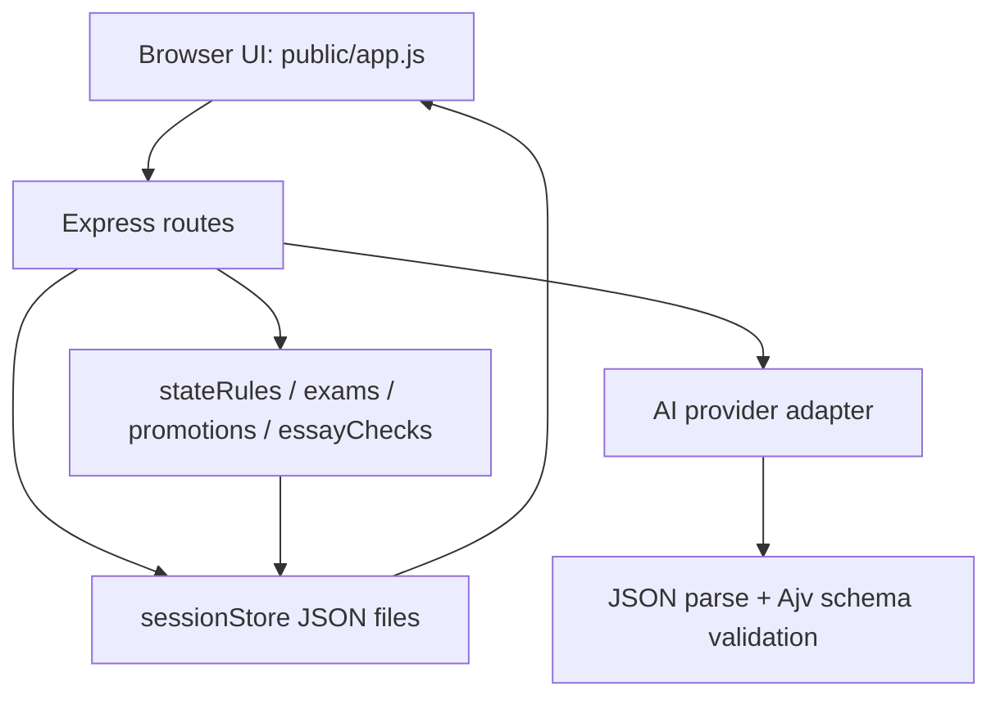

# Qianqiu Developer Architecture

This document is the short implementation map for developers continuing the phase-one codebase. The longer product and process source of truth remains [docs/QIANQIU_DEVELOPMENT_BRIEF.md](QIANQIU_DEVELOPMENT_BRIEF.md).

## Runtime Shape

Qianqiu is intentionally buildless in phase one:

- Backend: Node.js + Express in `server.js`.
- Frontend: plain HTML/CSS/JS in `public/`.
- Storage: local JSON files under `data/sessions/`.
- AI: adapter-based providers behind `src/ai/index.js`.
- Tests: Node.js built-in `node --test`.

The app should stay runnable with:

```bash
npm install
npm start
```

Then visit `http://localhost:3000`. Mock mode is the default local path.

## Request Flow



Important route ownership:

- `src/routes/game.js` creates sessions, reads sessions, and advances free-text turns.
- `src/routes/exam.js` generates saved exam questions and submits essays.
- `src/game/stateRules.js` is the only way provider state patches should be merged.
- `src/game/exams.js` owns exam levels, gates, thresholds and next-exam mapping.
- `src/game/promotions.js` owns rank changes, official promotion and severe-cheating consequences.
- `src/game/essayChecks.js` owns local anti-cheat checks and score penalties.
- `src/game/candidates.js` owns virtual same-field candidates, inspectable candidate essay profiles, and ranking.
- `src/game/examTravel.js` owns server-side exam entry preparation costs, travel events, and funded/shortfall effects.
- `src/game/relationships.js` owns NPC/faction relationship ledger creation, normalization, legacy backfill, and compact summaries.

## API Contract

### `GET /api/health`

Returns:

```json
{
  "ok": true,
  "aiProvider": "mock"
}
```

### `POST /api/game/start`

Request fields:

- `dynasty`
- `year`
- `role`
- `playerName`
- `background`
- `customSetting`

Returns `201` with `sessionId`, `worldState`, and opening `narrative`.

### `GET /api/game/state/:sessionId`

Reads the JSON session file and returns `sessionId` plus `worldState`.

### `POST /api/game/turn`

Request:

```json
{
  "sessionId": "uuid",
  "input": "研读《论语》三日"
}
```

Returns SSE when the request includes `Accept: text/event-stream`:

```text
event: state_preview
data: {"sessionId":"uuid","status":"accepted"}

event: narrative_chunk
data: {"text":"..."}

event: state_preview
data: {"sessionId":"uuid","attributeChanges":[],"relationshipChanges":[],"examTrigger":{},"worldTick":{}}

event: final_state
data: {"sessionId":"uuid","narrative":"...","attributeChanges":[],"relationshipChanges":[],"examTrigger":{},"worldTick":{},"worldState":{}}
```

If a provider/session error happens after the stream has opened, the route writes:

```text
event: error
data: {"error":"...","statusCode":500}
```

Requests without SSE negotiation still return plain JSON for tests and compatibility:

```json
{
  "sessionId": "uuid",
  "narrative": "...",
  "attributeChanges": [],
  "relationshipChanges": [],
  "examTrigger": {
    "shouldStart": false,
    "level": null,
    "reason": ""
  },
  "worldTick": {
    "summary": "月度推演：粮储略降，民心暂稳，边患暂稳。",
    "events": ["二月，户部核算钱粮，民间风声暂稳。"],
    "attributeChanges": []
  },
  "worldState": {}
}
```

### `POST /api/exam/question`

Request:

```json
{
  "sessionId": "uuid",
  "level": "child_exam"
}
```

`level` may be omitted; the server derives the next eligible exam from `player.examRank`. The route saves a complete `worldState.activeExam`, reuses an existing unanswered exam for the same level, and rejects attempts to open a different exam while another question is active.

Returns `examId`, exam metadata, requirements, readiness, and `worldState`.

### `POST /api/exam/submit`

Request:

```json
{
  "sessionId": "uuid",
  "examId": "child_exam-uuid",
  "essay": "..."
}
```

The server checks authenticity, asks the provider for grading, applies local penalties, builds virtual candidates with inspectable essay profiles, applies promotion or cheating consequences, appends the essay result to `player.examHistory`, clears `activeExam`, saves the session and returns the result plus `worldState`. The response includes `examQuestion`, `essay`, and `entryPreparation` so the browser can render the just-submitted archive directly.

## AI Provider Contract

Providers expose four methods:

- `startGame(worldState)`
- `runTurn(worldState, input)`
- `generateExamQuestion(worldState, exam)`
- `gradeExamEssay(worldState, exam, essay, authenticityCheck)`

Provider outputs must match the schemas in `src/ai/schemas.js`:

- `opening`: `{ narrative, events }`
- `turn`: `{ narrative, statePatch, attributeChanges, relationshipChanges, events, examTrigger }`
- `examQuestion`: exam level, name, question, type, difficulty, requirements, word count, pass score and promotion rank
- `grade`: five score dimensions, `overall_score`, rank, detailed feedback, authenticity echo, candidates and ranking placeholders

Real provider adapters parse model text through `src/utils/json.js`, validate with Ajv, retry once on failure, then fall back to Mock for that method. The model never owns final game state. It can suggest `statePatch`; the server whitelists and clamps it.

For turn responses, providers may also suggest top-level `relationshipChanges`. These are not state patches. They are bounded social-memory deltas for existing visible relationship ledger ids, and the server is free to clamp or ignore them before persistence. Mock now emits these suggestions for scholar, emperor, minister, general, magistrate, and official actions so local play can exercise social memory without real model keys.

## State Model

`createInitialState()` in `src/game/initialState.js` returns a `worldState` with:

- Global fields: `sessionId`, `year`, `month`, `dynasty`, `turnCount`, `treasury`, `grainReserve`, `population`, `publicOrder`, `taxRate`, `corruption`, `armySize`, `armyMorale`, `borderThreat`.
- Factions: `factions.eunuchs`, `factions.scholarOfficials`, `factions.militaryLords`.
- Narrative, relationship, and exam fields: `characters`, `relationshipLedger`, `eventHistory`, `activeExam`, `setup`.
- Player identity: `player.role`, `roleLabel`, `name`, `health`, `gold`.
- Scholar fields: `examRank`, `palaceRank`, `officeTitle`, `academia`, `literaryTalent`, `adaptability`, `mentality`, `reputation`, `examHistory`, `teacher`, `studiedBooks`, `connections`.
- Role fields: `personalPower`, `courtControl`, `mandate`, `position`, `faction`, `influence`, `integrity`.
- Official fields: `superiorFavor`, `peerNetwork`, `performanceMerit`, `promotionProspect`, `impeachmentRisk`, `cleanReputation`.
- General fields: `command`, `troops`, `supply`, `battleReputation`, `scouting`, `campaignRisk`.
- Magistrate fields: `countyName`, `localTreasury`, `localOrder`, `gentryRelations`, `banditPressure`, `pendingLawsuits`, `corveeBurden`, `waterworks`.

`relationshipLedger` is the S22.1 server-owned social memory layer. It records current character and faction entries with `stance`, `relationship`, `resentment`, `networkSource`, `recentIntent`, `visible`, and `lastUpdatedTurn`. Character entries are keyed by current `characters[].id`; faction entries are keyed by existing numeric `factions` keys.

Allowed roles currently include `scholar`, `emperor`, `minister`, `general`, `magistrate`, and `official`. Mock gameplay has dedicated loops for all of those roles, with the scholar -> exam -> official path still treated as the critical route.

## State Patch Rules

`applyStatePatch(worldState, statePatch, options)` enforces:

- Only whitelisted top-level and `player` keys can be changed.
- Numeric fields are clamped to ranges in `NUMERIC_RANGES`.
- `eventHistory` is trimmed to the latest 20 entries.
- `statePatch.factions` may only update existing numeric faction keys; providers cannot invent arbitrary faction names.
- `turnCount` increments when a turn patch is applied.
- Server-owned follow-up patches may pass `{ incrementTurnCount: false }` so S21.3 can apply a tick patch without double-counting one player turn.
- `relationshipLedger` is not an allowed provider patch key. The AI schema rejects it, and `applyStatePatch()` ignores it if a non-schema provider tries to include it anyway.
- Provider social-memory effects must go through top-level `relationshipChanges`, which `src/routes/game.js` applies through `applyRelationshipChanges()` after the ordinary turn patch increments `turnCount`.

Do not bypass this module when applying provider output.

## Relationship Ledger Contract

The S22 relationship contract is recorded in [docs/RELATIONSHIP_LEDGER_CONTRACT.md](RELATIONSHIP_LEDGER_CONTRACT.md).

`createInitialState()` creates `worldState.relationshipLedger` from the starting character list and known numeric factions. Game and exam routes call `ensureRelationshipLedger()` after reading sessions so older JSON saves are backfilled before they are returned or written again.

The ledger is deliberately server-owned. It normalizes text fields, clamps relationship values to `-100..100`, clamps resentment to `0..100`, drops invented character/faction ledger ids, and preserves only short `recentNotes`.

S22.2 adds the controlled relationship-suggestion path and prompt summary. Turn prompts include a compact visible-only relationship summary. Provider `relationshipChanges` suggestions are processed at most five per turn; they must target existing visible entries, use `relationshipDelta` clamped to `-12..12`, use `resentmentDelta` clamped to `-10..10`, and may only update short `stance`, `recentIntent`, and note text. Applied changes are returned in JSON and SSE payloads as `relationshipChanges`.

S22.3 makes Mock produce concrete relationship suggestions after it classifies the resolved action from its own `statePatch` and `examTrigger`. S23.1 extends that Mock reaction path to magistrate actions, S23.2 extends it to general actions, and S23.3 deepens the official reactions around superiors, peers, clean-name standing, impeachment and informal brokerage. The suggestions still target only visible ledger entries and still pass through `applyRelationshipChanges()` in the route before persistence. The browser appends concise `[人脉]` lines for applied changes.

## Official Role Loop

S23.3 deepens the post-palace official career loop without letting ordinary turns grant a new office title or role promotion. Official state lives under `player` and passes through the normal AI schema plus `applyStatePatch()` whitelist/clamp boundary.

Official state fields:

- `superiorFavor`: how favorably direct superiors view the player's usefulness and discipline, clamped to `0..100`.
- `peerNetwork`: strength of同年/colleague support, clamped to `0..100`.
- `performanceMerit`: current考成 merit record, clamped to `0..100`.
- `promotionProspect`: chance-like career momentum toward future升迁, clamped to `0..100`; it does not itself change `officeTitle`.
- `impeachmentRisk`: exposure to counterattack, audit, and弹劾 risk, clamped to `0..100`.
- `cleanReputation`: public清操/clean-name standing, clamped to `0..100`.

Palace-exam promotion now seeds these fields and appends a visible official superior contact (`C02`) while preserving the complete scholar -> official path. Mock official turns recognize assessment/promotion work, impeachment, observation under superiors, casework, relief/farming, peer networking, bribery, and routine office work. These actions may update official career fields and limited global fields such as `corruption`, `publicOrder`, `grainReserve`, `population`, and existing numeric factions. Relationship consequences remain suggestions only and are applied through the route-owned relationship ledger merge.

## General Role Loop

S23.2 adds a dedicated military command loop without changing the complete scholar -> official path. General state lives under `player` and passes through the normal AI schema plus `applyStatePatch()` whitelist/clamp boundary.

General state fields:

- `command`, `battleReputation`, `scouting`, `campaignRisk`: command and campaign condition meters, clamped to `0..100`.
- `troops` and `supply`: local command strength and military stores, clamped to `0..1000000`.

Mock general turns recognize six action families: recruitment, supply/pay work, drill, scouting, fortification, and campaign action. These actions may update local military player fields and limited global fields such as `treasury`, `grainReserve`, `armySize`, `armyMorale`, `borderThreat`, `publicOrder`, and existing numeric factions. Relationship consequences are still suggestions only and are applied through the route-owned relationship ledger merge.

## Magistrate Role Loop

S23.1 adds the first dedicated local magistrate loop without changing the complete scholar -> official path. Magistrate state lives under `player` and passes through the normal AI schema plus `applyStatePatch()` whitelist/clamp boundary.

Magistrate state fields:

- `countyName`: display name for the current county.
- `localTreasury`: county-level cash reserve, clamped to `0..100000`.
- `localOrder`, `gentryRelations`, `banditPressure`, `pendingLawsuits`, `corveeBurden`, `waterworks`: local condition meters, clamped to `0..100`.

Mock magistrate turns recognize six action families: case hearings, money/grain work, gentry mediation, anti-bandit policing, corvee labor, and waterworks. These actions may update both local player fields and limited global world fields such as `treasury`, `grainReserve`, `population`, `publicOrder`, `corruption`, and existing numeric factions. Relationship consequences are still suggestions only and are applied through the route-owned relationship ledger merge.

## Phase-Two World Tick Contract

S21.1 defines the server-owned simulation boundary in [docs/WORLD_TICK_CONTRACT.md](WORLD_TICK_CONTRACT.md). S21.2 implements the pure module in `src/game/worldTick.js`; S21.3 wires that module into `POST /api/game/turn`.

The contract for S21.2-S21.4 is:

- Add `worldState.month` as a top-level calendar field, defaulting to `1`.
- Run one minimal tick after each successful `POST /api/game/turn` action.
- Advance one in-game month per valid free-text turn; roll month 12 to 1 and increment `year`.
- Let the server, not the provider, compute natural changes to treasury, grain reserve, population, public order, corruption, army morale, border threat, and existing numeric faction keys.
- Keep `turnCount` to one increment per player turn even when provider output and tick output both change state.
- Apply tick changes through the same whitelist/clamp boundary used for provider patches.
- Return short visible tick feedback as `worldTick` in JSON/SSE payloads and append tick events after provider events.
- Do not touch exam rank, active exam, exam history, role promotion, session identity, or the complete scholar -> official path.

`runWorldTick(worldState)` returns `{ statePatch, attributeChanges, events, summary }` without mutating `worldState`. Its first deterministic formulas cover treasury revenue/upkeep/leakage, grain consumption/harvest, population drift, public order, corruption, army morale, border threat, and small known-faction drift.

Route integration order is provider patch first, exam trigger setup when requested, `runWorldTick()` against the updated state, tick patch with `{ incrementTurnCount: false }`, then provider events followed by tick events. The browser renders the current month in the status strip and appends concise monthly feedback below the provider narrative.

Provider turn schemas and prompts do not expose `year` or `month` as allowed model patch keys; calendar changes are reserved for server-owned patches.

## Exam Rules

The exam path is:

```text
寒窗 -> 童试 -> 秀才 -> 乡试 -> 举人 -> 会试 -> 贡士 -> 殿试 -> 进士 -> 入仕官员
```

Exam levels:

| Level | Name | Required Rank | Promotion | Pass |
| --- | --- | --- | --- | --- |
| `child_exam` | 童试 | none | 秀才 | 60 |
| `provincial_exam` | 乡试 | 秀才 | 举人 | 68 |
| `metropolitan_exam` | 会试 | 举人 | 贡士 | 74 |
| `palace_exam` | 殿试 | 贡士 | 进士 / official | normally not failed unless severe cheating |

Promotion is applied in `src/game/promotions.js`, not by the provider. Palace exam assigns `player.role = "official"`, a palace rank, an office title, `position`, `faction`, `influence`, `integrity`, and the initial S23.3 official career meters.

Exam entry preparation is applied in `POST /api/exam/question` by `src/game/examTravel.js`, not by the provider. It charges level-specific travel/preparation cost, converts unfunded shortfall into small clamped `player.health`, `mentality`, `adaptability`, or `reputation` effects, stores `activeExam.entryPreparation`, and appends a concise travel event. It uses `applyStatePatch(..., { incrementTurnCount: false })`, so taking a question does not advance `turnCount` or `year/month`. Existing unanswered exams are reused without retroactive travel cost.

Virtual candidates now include `essay`, `style`, `examinerComment`, `strengths`, and `weaknesses`. These fields are server-generated in Mock/default local play and saved into exam history with the ranking, allowing the browser to show 同场文卷 and later review them through 考试档案.

## Persistence

Session files are written to `data/sessions/{sessionId}.json`. Session ids must match a UUID-like safe pattern before the path is built. `data/sessions/*.json` is ignored by Git; only `data/sessions/.gitkeep` should be committed.

## Verification

Use:

```bash
npm test
```

For local acceptance, run the checklist in [docs/MANUAL_ACCEPTANCE.md](MANUAL_ACCEPTANCE.md). When a release slice is accepted, record the exact commands, result and known limitations in [docs/PHASE_ONE_ACCEPTANCE.md](PHASE_ONE_ACCEPTANCE.md), `docs/SHARED_CONTEXT.md`, and `docs/DEVELOPMENT_STEPS.md`.
