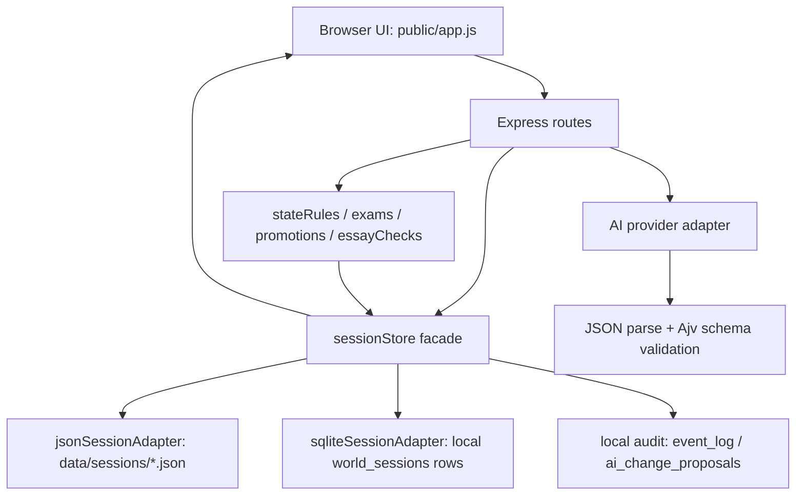

# Qianqiu Developer Architecture

This document is the short implementation map for developers continuing the phase-one codebase. The longer product and process source of truth remains [docs/QIANQIU_DEVELOPMENT_BRIEF.md](QIANQIU_DEVELOPMENT_BRIEF.md).

## Runtime Shape

Qianqiu is intentionally buildless in phase one:

- Backend: Node.js + Express in `server.js`.
- Frontend: plain HTML/CSS/JS in `public/`.
- Storage: `src/storage/sessionStore.js` is the route-facing storage facade. The default adapter is still local JSON files under `data/sessions/`, implemented by `src/storage/jsonSessionAdapter.js`. Optional local SQLite lives in `src/storage/sqliteSessionAdapter.js`; it stores one row per session with metadata columns, `revision`, timestamps, and JSON `world_state_json`, selected by `STORAGE_ADAPTER=sqlite`. SQLite mode also uses `src/storage/sqliteGeographyTables.js` to maintain local `geo_*` geography business rows from the same `worldState.worldGeography` snapshot, `src/storage/sqlitePeopleTables.js` to maintain local `people_*` rows from the normalized visible `worldPeople` bridge projection plus server people-event `last_event_id` links, `src/storage/sqliteOfficialPostingTables.js` to maintain local `office_*` rows from the normalized safe `officialPostings` projection plus S56.3 content drift checks, `src/storage/sqliteEventArchiveTables.js` to maintain local `event_archive_index` rows from sanitized `eventArchiveView` items, and `src/storage/sqlitePromptRetrievalTables.js` to maintain local `prompt_retrieval_index` rows from server-visible prompt projections, including S64.1 military diplomacy report rows derived from `militaryDiplomacyView`, S64.2 economic fiscal report rows derived from `economicFiscalView`, S65.1 public event-chain rows from `historicalEventArchiveView`, and S65.2 intelligence rumor rows from `intelligenceRumorView`. S54.3 adds `scripts/sqliteGeographyTool.js` for local geography import/status/repair/redacted-export operations. Local audit records use `event_log` and `ai_change_proposals`: JSON mode writes sidecar JSONL files under `data/audit/`, while SQLite mode writes local tables; S57.2 adds `src/game/auditPublicProjection.js` and `scripts/auditEventArchiveTool.js` for local public-audit projection export/status without exposing raw audit or proposal content. S49-S53 foundation details are archived in [docs/LOCAL_DATABASE_FOUNDATION_ARCHIVE.md](LOCAL_DATABASE_FOUNDATION_ARCHIVE.md); S54-S59 business table, index, maintenance, parity, and dual-mode acceptance details are archived in [docs/LOCAL_DATABASE_BUSINESS_TABLE_ARCHIVE.md](LOCAL_DATABASE_BUSINESS_TABLE_ARCHIVE.md); S60-S67 content-density, fixture, prompt strategy, information-panel paging, and scale-acceptance details are archived in [docs/HUGE_DYNAMIC_WORLD_CONTENT_ARCHIVE.md](HUGE_DYNAMIC_WORLD_CONTENT_ARCHIVE.md). Remote saves, accounts, multiplayer sync, cloud conflict resolution, and hosted databases are outside the current scope.
- S67.1 integration acceptance: `scripts/dualModeAcceptance.js` is the repeatable JSON/SQLite hardening entrypoint. Default mode chains JSON full Mock browser smoke, SQLite full Mock browser smoke, focused information-panel parity, storage/tooling checks, and large-fixture scale regression; `--storage-only` keeps a no-browser path for JSON -> SQLite import, geography repair/export, audit projection, derived table counts, large fixture counts, prompt strategy, information-panel paging, event archive paging, SQLite prompt-index read repair, memory/timing thresholds, and hidden-token redaction.
- AI: adapter-based providers behind `src/ai/index.js`.
- Tests: Node.js built-in `node --test`.
- Browser smoke: `playwright-core` driving an installed Chrome/Edge browser through `scripts/browserSmoke.js`.

Dependency and plugin changes are governed by [docs/DEPENDENCY_PLUGIN_GOVERNANCE.md](DEPENDENCY_PLUGIN_GOVERNANCE.md). New packages, plugins, external service SDKs, or open-source references must document purpose, license, maintenance status, alternatives, test coverage, docs landing points, and rollback before they are treated as accepted architecture.

The app should stay runnable with:

```bash
npm install
npm start
```

Then visit `http://localhost:3000`. Mock mode is the default local path.

`server.js` applies a restrictive CORS policy by default: no-`Origin` requests and the current `PORT`'s localhost/127.0.0.1/[::1] origins are allowed, while extra development origins must be listed in `CORS_ALLOWED_ORIGINS`.

## Request Flow



Important route ownership:

- `src/ai/promptContextAssembler.js` owns the S53.1/S58.1 prompt context assembler. It centralizes dynamic prompt summaries and builds ranked `retrievalContext` from server-visible projections only; S57.1 makes recent-event retrieval and `src/ai/prompts.js` compact `recentEvents` read sanitized `eventArchiveView` items instead of raw `eventHistory` text, S63.2 adds capped local-affairs docket summaries from `localAffairsDocketView`, S64.1 adds capped `events.militaryReports` rows plus a top-level `militaryDiplomacy` prompt summary from `militaryDiplomacyView`, S64.2 adds capped `events.economicReports` rows plus a top-level `economicFiscal` prompt summary from `economicFiscalView`, S65.1 adds capped `events.eventChains` rows from public historical event chains, and S65.2 adds capped `intel.rumors` rows plus a top-level `intelligenceRumors` prompt summary from `intelligenceRumorView`; both rumor surfaces follow `promptBudgetProfile`, so ordinary turns keep one short rumor and high-relevance prompts keep at most four. In SQLite mode, `sqliteSessionAdapter` attaches a non-enumerable safe retrieval source backed by `prompt_retrieval_index`, and the assembler uses it only for retrieval rows while keeping JSON/view helper fallback. It does not read raw hidden ledgers, raw audit sidecars, SQLite audit tables, provider configuration, local paths, or raw business rows as prompt truth.
- `src/routes/game.js` creates sessions, reads sessions, and advances free-text turns.
- `src/routes/exam.js` generates saved exam questions, advances exam-local scene phases, and submits essays.
- `docs/IMPERIAL_EXAM_SYSTEM_CONTRACT.md` owns the S68.1 imperial-exam system contract. It keeps the external `child_exam`、`provincial_exam`、`metropolitan_exam`、`palace_exam` levels and existing exam routes compatible, while defining the future internal procedure phases for 县试/府试/院试、乡试/会试三场、多卷生命周期、保结、搜检、号舍、弥封、誊录、对读、磨勘、复核、多考官 proposal、名次荣誉 and 授官 resolver. Future code should implement those as server-owned state/view layers rather than provider-owned fields.
- `src/game/studyProfile.js` and `src/game/studyProfileConfig.js` own S68.2-S68.3 读书账本、老师点评 and 书院/同窗互动. `worldState.studyProfile` is server-owned and normalized on old saves; route payloads expose only `studyProfileView`, and prompt context receives only the capped `studyProfile` summary. Ordinary study-like player actions update the ledger after provider patch boundaries, while exam submission refreshes weaknesses, strengths, teacher advice, teacher feedback, book recommendations, small exercises, sponsorship readiness, and the next plan from saved score/audit history. S68.3 also lets server-resolved teacher/academy/classmate interactions update visible `characters -> relationshipLedger -> relationshipView/worldPeopleView` rows. Providers may read the summary and return `teacherFeedbackProposal` text, but ordinary provider patches cannot write `studyProfile`, `player.teacher`, `player.position`, create durable relationships, grant exam ranks, appointments, or official posts.
- `src/routes/ai.js` owns no-session AI diagnostics such as provider connection checks.
- `src/game/informationPanelPage.js` owns the S66.2 browser information paging projection. It builds `informationPanelPageView` for 天下格局、任所地理、人物谱牒、官职簿 and 事件档案 from server route views plus sanitized event archive index items, supports query/filter/sort/page/pageSize, and filters hidden/raw/path/key-shaped text. It does not read raw SQLite tables, raw audit rows, provider proposals, full prompts, local paths, or keys.
- `docs/BROWSER_INFORMATION_PANEL_PLAN.md` owns the S53/S66 browser information panel plan. It maps 天下格局、任所地理、人物谱牒、官职簿 and 事件档案 panels to route views, with S53.4 covering geography/posting geography, S53.5 covering people/official-posting cards, S53.6 covering the sanitized event archive projection plus browser cards, and S66.2 covering server-side search/filter/sort/pagination metadata.
- `src/game/stateRules.js` is the only way provider state patches should be merged.
- `src/game/exams.js` owns exam levels, gates, thresholds and next-exam mapping.
- `src/game/promotions.js` owns rank changes, official promotion and severe-cheating consequences.
- `src/game/essayChecks.js` owns local anti-cheat checks and score penalties.
- `src/game/time.js` owns shared calendar constants and helpers for month labels, `tenDayPeriod`, year-month-period formatting, ten-day advancement, and turn/month conversion.
- `src/game/candidates.js` owns virtual same-field candidates, inspectable candidate essay profiles, and ranking.
- `src/game/examTravel.js` owns server-side exam entry preparation costs, travel events, and funded/shortfall effects.
- `src/game/examCalendar.js` owns S35 exam windows, preparation/travel month summaries, missed-window records, persistent same-field rivals, and palace-exam peer contacts.
- `src/game/examSceneTime.js` owns S48.4 exam-local phases, date stamps, scene cadence feedback, and submitted-phase archival fields.
- S68.1 requires future deeper exam procedure state to remain scene-local unless a later contract explicitly adds cross-month examination rules. Hidden roll mappings, examiner hidden intent, sponsorship hidden notes, raw provider proposals, raw audit rows, local paths, and keys must not be exposed through prompt/browser views or ordinary route projections.
- `src/game/relationships.js` owns NPC/faction relationship ledger creation, normalization, legacy backfill, compact prompt summaries, and the S32.1/S32.2 player-facing relationship inspection view. Visible-only summaries filter hidden contacts, factions, and hidden-entry notes before prompt/UI exposure.
- `src/game/activeRequests.js` owns the S32.3 server-scheduled active NPC/faction request loop. Providers may suggest narrative and relationship consequences, but they do not create, replace, resolve, or expire `worldState.activeNpcRequest`.
- `src/game/worldPeopleSchemas.js` owns the S51.1 schema contract for future NPC, household, asset, estate, relationship, and visibility rows. It normalizes/clamps rows, builds hidden-filtered schema views, and provides capped prompt summaries. S55.1 extends the same document-level contract with SQLite `people_npcs`、`people_households`、`people_assets`、`people_estates`、`people_relationships` table boundaries; S55.2 persists the current visible bridge rows through `src/storage/sqlitePeopleTables.js`; S55.3 adds `src/game/worldPeopleEvents.js` for safe server people-event summaries and audit links.
- `src/game/worldPeople.js` owns the S51.2 runtime bridge from legacy `characters`, `relationshipLedger`, and visible `activeNpcRequest` rows into safe `worldState.worldPeople`, `worldPeopleView`, and capped prompt summaries. It is a projection bridge, not the hidden NPC database.
- `src/game/longTermEvents.js` owns the S33 server-scheduled long-term event queue for seasonal, disaster, border, court, local case-chain, and cross-month consequence events. Providers may read a compact summary for narrative context, but they do not create, replace, resolve, or expire `worldState.longTermEvents`.
- `src/game/officialCatalog.js` owns the S42.2 static office/bureau catalog used to normalize office titles, bureau duties, and promotion/transfer/outpost candidates.
- `src/game/officialPostingSchemas.js` owns the S52.1 schema contract for官署、官职、任所、考成和迁转 rows. It normalizes/clamps rows, builds hidden-filtered schema views, and provides capped prompt summaries. S56.1 extends the same document-level contract with SQLite `office_bureaus`、`office_catalog`、`office_city_jurisdictions`、`office_postings`、`office_assessments`、`office_transfers` boundaries; S56.2 persists the current safe projection through `src/storage/sqliteOfficialPostingTables.js`; S56.3 adds derived-row content drift detection for same id / same revision pollution and old missing-hash rows.
- `src/game/officialPostings.js` owns the S52.2 runtime bridge from `officialCatalog`, `officialCareer`, magistrate role state, and visible `worldGeographyView` city/jurisdiction rows into safe `worldState.officialPostings`, `officialPostingsView`, and capped prompt summaries. S63.1 extends this bridge with visible official-ecosystem and appointment-pool projection rows for superiors, clerks/advisers, vacancies, candidates, mourning leave, restoration, impeachment pressure, and assignment ids. It is a visible projection bridge, not the hidden office-posting database or appointment authority.
- `src/game/localAffairsDockets.js` owns the S63.2 local affairs docket projection. It derives money, legal, relief, waterworks, banditry, corvee, gentry, epidemic, and term-closure dockets from `worldGeographyView` city metrics plus `officialPostingsView` jurisdiction/posting rows. It returns `localAffairsDocketView`, capped prompt summaries, event-archive `local_docket` material, and SQLite prompt retrieval rows; it does not write city metrics, `officialCareer`, `officialPostings`, `geo_*`, `office_*`, `event_archive_index`, or `prompt_retrieval_index`.
- `src/game/militaryDiplomacy.js` owns the S64.1 military diplomacy projection. It derives border theaters, garrisons, supply lines, diplomatic contacts, and frontier incidents from visible `worldGeographyView`, `worldPeopleView`, and `officialPostingsView`, with caps and role access in `src/game/militaryDiplomacyConfig.js`. It returns `militaryDiplomacyView`, capped prompt summaries, event-archive `military_diplomacy` material, and SQLite prompt retrieval rows; it does not write geography, people, postings, troops, diplomacy, `event_archive_index`, or `prompt_retrieval_index`.
- `src/game/economicFiscal.js` owns the S64.2 economic fiscal projection. It derives fiscal ledgers, grain-market reports, trade/salt/canal routes, local-treasury relief reports, debt/corruption risks, and market incidents from visible `worldGeographyView`, `officialPostingsView`, `localAffairsDocketView`, `worldEntityView`, and `worldPeopleView`, with caps and role access in `src/game/economicFiscalConfig.js`. It returns `economicFiscalView`, capped prompt summaries, event-archive `economic_fiscal` material, and SQLite prompt retrieval rows; it does not write geography, people, postings, taxes, markets, debt, relief, `event_archive_index`, or `prompt_retrieval_index`.
- `src/game/historicalEventArchive.js` owns the S65.1 historical event archive projection. It derives public event chains from visible local affairs, military diplomacy, economic fiscal, official postings, world people, and exam-history material; sealed chains are only produced when the server explicitly requests `includeSealed` and must not enter normal routes, prompt retrieval, browser views, or SQLite prompt rows.
- `src/game/intelligenceRumors.js` owns the S65.2 intelligence rumor projection. It derives role-scoped rumor/report/private-letter/scout-note rows from `worldGeographyView`, `localAffairsDocketView`, `militaryDiplomacyView`, `economicFiscalView`, `worldPeopleView.relationships`, and public historical event chains, with caps and access rules in `src/game/intelligenceRumorsConfig.js`. It returns `intelligenceRumorView`, capped prompt summaries, event-archive `intelligence_rumor` material, and SQLite prompt retrieval rows; it does not write canonical state, reveal hidden intelligence truth, write audit, write `event_archive_index`, or write `prompt_retrieval_index`.
- `src/game/worldGeographySeeds.js` owns the S50.1 static geography seed catalog for countries, neighboring polities, regions, cities, routes, frontier zones, office jurisdictions, and initial visibility.
- `src/game/worldGeography.js` owns the S50.2 server-owned per-session geography ledger. It normalizes `worldState.worldGeography`, refreshes light country/city/route/frontier pressure snapshots from current world metrics, builds hidden-filtered `worldGeographyView`, and provides the capped `worldGeography` prompt summary. Providers may read the summary but may not patch the ledger.
- `src/storage/sqliteGeographyTables.js` owns the S54.2 SQLite-only geography business tables. It creates and synchronizes `geo_countries`, `geo_regions`, `geo_cities`, `geo_routes`, `geo_frontier_zones`, and `geo_office_jurisdictions` from normalized session geography rows, repairs missing/stale table rows from `world_sessions.world_state_json` on read, and exposes a read-only repair status helper for S54.3 tooling dry-runs.
- `src/storage/sqlitePeopleTables.js` owns the S55.2/S55.3 SQLite-only people business tables. It creates and synchronizes `people_npcs`, `people_households`, `people_assets`, `people_estates`, and `people_relationships` from the normalized visible `worldPeople` bridge projection, applies safe `peopleEventLinks` to `last_event_id`, repairs missing/stale/mismatched table rows from `world_sessions.world_state_json` on read, and never treats raw `people_*` rows as route state, prompt, or browser sources.
- `src/storage/sqliteOfficialPostingTables.js` owns the S56.2/S56.3 SQLite-only official-posting business tables. It creates and synchronizes `office_bureaus`, `office_catalog`, `office_city_jurisdictions`, `office_postings`, `office_assessments`, and `office_transfers` from the normalized safe `officialPostings` projection, records `metadata_json.contentHash` for derived-row drift checks, repairs missing/stale/mismatched/tampered rows from `world_sessions.world_state_json` on read, and never treats raw `office_*` rows as appointment authority, route state, prompt, or browser sources.
- `src/storage/sqliteEventArchiveTables.js` owns the S57.1 SQLite-only safe event archive index. It creates and synchronizes `event_archive_index` from `buildEventArchiveIndexItems(worldState)`, records `metadata_json.contentHash` for derived-row drift checks, repairs missing/stale/mismatched/tampered rows from `world_sessions.world_state_json` on read, and never treats raw `event_log`, `ai_change_proposals`, or raw index rows as route state, prompt, or browser sources.
- `src/storage/sqlitePromptRetrievalTables.js` owns the S58.1 SQLite-only safe prompt retrieval index. It creates and synchronizes `prompt_retrieval_index` from `worldGeographyView`、`worldPeopleView`、`officialPostingsView`、`localAffairsDocketView`、`militaryDiplomacyView`、`economicFiscalView`、`historicalEventArchiveView` 公开事件链、`intelligenceRumorView` 和 `eventArchiveView` 的 compact server-visible rows, records `metadata_json.contentHash`, repairs missing/stale/mismatched/tampered rows from `world_sessions.world_state_json` on read, and never reads `geo_*`、`people_*`、`office_*`、`event_log` or `ai_change_proposals` as prompt truth.
- `src/game/auditPublicProjection.js` and `scripts/auditEventArchiveTool.js` own the S57.2 local audit-to-public projection workflow. The helper only projects `visibility: "public"` audit summaries through the event-archive sanitizer and a small related/applied allowlist; the CLI can run `status` or `export` against JSON sidecars or SQLite audit tables, counts AI proposals without returning their contents, and never writes back to route state, prompt context, browser views, or `event_archive_index`.
- `scripts/dualModeAcceptance.js` owns the S67.1 dual-mode acceptance workflow. It reuses browser smoke for完整 Mock 主线和局势簿 parity，并在 storage-only path 中核验 JSON -> SQLite dry-run/正式导入、地理修复/导出、审计公开 projection、派生表计数、large fixture 总量、S66.1 `retrievalContext.strategy`、S66.2 `informationPanelPageView`、事件档案分页、SQLite `prompt_retrieval_index` 删除后读档修复、内存/耗时门槛和 raw table/prompt/key/path/hidden-token 防线。
- `src/game/officialCareer.js` owns the S34/S42 official career outcome engine. Providers may move official career meters, but they do not appoint, transfer, promote, demote, impeach-to-case, punish, retain, create assignments, alter assessment dossiers, or write `worldState.officialCareer`.
- `src/game/roleWorldCoupling.js` owns the S36/S48.5 role/world coupling step. Providers may move ordinary meters and suggest social changes, but they do not write `worldState.roleWorldCoupling` or decide the server-owned compound world consequences or month-derived cooldowns of key role actions.
- `src/game/worldThreads.js` owns the S43.1 World Threads / 世界议程索引. It derives player-facing cross-month issue summaries from active requests, long-term events, official assignments/outcomes, role-world impacts, frontier pressure, faction pressure, and local case pressure. Providers may read the compact summary for narrative context, but they do not write `worldState.worldThreads`.

## API Contract

### `GET /api/health`

Returns:

```json
{
  "ok": true,
  "aiProvider": "mock"
}
```

### `POST /api/game/start`

Request fields:

- `dynasty`
- `year`
- `role`
- `playerName`
- `background`
- `customSetting`

As of S31.3, `role` is normalized and validated in `src/game/initialState.js`. Missing or blank role values default to `scholar`; unsupported roles return `400`. The accepted enum is `scholar`, `emperor`, `minister`, `general`, `magistrate`, and `official`, and the browser start form exposes all six values.

Returns `201` with `sessionId`, `worldState`, `examCalendarView`, `examRivalView`, `studyProfileView`, `relationshipView`, `activeNpcRequestView`, `roleWorldCouplingView`, `worldGeographyView`, `worldEntityView`, `worldPeopleView`, `worldThreadView`, `longTermEventView`, `officialCareerView`, `officialPostingsView`, `localAffairsDocketView`, `militaryDiplomacyView`, `economicFiscalView`, `historicalEventArchiveView`, `intelligenceRumorView`, `eventArchiveView`, `informationPanelPageView`, and opening `narrative`.

### `GET /api/game/state/:sessionId`

Reads the session through the storage facade and returns `sessionId`, `worldState`, the player-facing `examCalendarView`, `examRivalView`, `studyProfileView`, `relationshipView`, `activeNpcRequestView`, `roleWorldCouplingView`, `worldGeographyView`, `worldEntityView`, `worldPeopleView`, `worldThreadView`, `longTermEventView`, `officialCareerView`, `officialPostingsView`, `localAffairsDocketView`, `militaryDiplomacyView`, `economicFiscalView`, `historicalEventArchiveView`, `intelligenceRumorView`, `eventArchiveView`, and `informationPanelPageView`.

S66.2 adds optional information panel query parameters:

- `informationTab` / `informationPanelTab` / `informationCollection`
- `informationQuery` / `informationSearch`
- `informationFilter`
- `informationSort`
- `informationPage`
- `informationPageSize`

The route uses those parameters only to shape `informationPanelPageView.activePage`; every page is still derived from server route views or sanitized event archive items. Unsafe query text is rejected and the payload must not expose raw SQLite table names, audit rows, provider proposals, prompt text, local paths, keys, or hidden notes.

### `GET /api/game/saves`

Returns the local save list as redacted session metadata:

```json
{
  "saves": [
    {
      "sessionId": "uuid",
      "storageSchemaVersion": 1,
      "revision": 2,
      "createdAt": "2026-05-06T00:00:00.000Z",
      "updatedAt": "2026-05-06T00:01:00.000Z",
      "playerName": "未定",
      "role": "scholar",
      "roleLabel": "书生",
      "dynasty": "明",
      "year": 1644,
      "month": 1,
      "tenDayPeriod": 1,
      "turnCount": 0,
      "examRank": null,
      "palaceRank": null,
      "officeTitle": null,
      "summary": "寒窗士子"
    }
  ],
  "skipped": []
}
```

The route does not return full `worldState`, raw relationship ledgers, hidden contacts, provider config, prompts, or local file paths. It sorts saves by `updatedAt` descending. Malformed or unsupported `.json` files are reported under `skipped` instead of being auto-deleted.

The browser consumes this route in two places: the start panel renders `#save-list-panel` for recent local saves, and the in-game status strip exposes a `#save-list-open` button that opens `#save-list-modal`. Loading a save still reads `GET /api/game/state/:sessionId`, writes `localStorage["qianqiu.sessionId"]` for compatibility, and renders only the normal route payloads.

### `POST /api/ai/connection-test`

Runs a no-session provider diagnostic for the currently configured provider or a requested provider:

```json
{
  "provider": "deepseek"
}
```

Returns `200` when the provider can produce schema-valid opening JSON, or `503` when a key/config/network/model error prevents the check:

```json
{
  "ok": true,
  "provider": "deepseek",
  "configuredProvider": "deepseek",
  "checkedAt": "2026-05-06T00:00:00.000Z",
  "latencyMs": 1200,
  "supportsStreaming": true,
  "models": {
    "default": "deepseek-v4-flash",
    "opening": "deepseek-v4-pro",
    "turn": "deepseek-v4-flash",
    "examQuestion": "deepseek-v4-flash",
    "grade": "deepseek-v4-pro"
  },
  "openingEventCount": 2,
  "narrativePreview": "..."
}
```

The diagnostic calls provider factories directly, does not create or mutate a session file, does not use Mock fallback to hide a real-provider failure, and redacts configured API keys from error messages. The browser start panel uses this route for its `AI 连接` check.

### `POST /api/game/turn`

Request:

```json
{
  "sessionId": "uuid",
  "input": "研读《论语》三日"
}
```

Returns SSE when the request includes `Accept: text/event-stream`:

```text
event: state_preview
data: {"sessionId":"uuid","status":"accepted"}

event: narrative_chunk
data: {"text":"..."}

event: state_preview
data: {"sessionId":"uuid","attributeChanges":[],"relationshipChanges":[],"examTrigger":{},"worldTick":{}}

event: final_state
data: {"sessionId":"uuid","narrative":"...","attributeChanges":[],"relationshipChanges":[],"examTrigger":{},"worldTick":{},"worldState":{}}
```

If a provider/session error happens after the stream has opened, the route writes:

```text
event: error
data: {"error":"...","statusCode":500}
```

The browser keeps streamed narrative pending until `final_state`; if the stream later emits `error` or ends without a final payload, that temporary text is removed and only the error is shown.

S44.2 routes SSE error text through `redactSecrets()` before sending it to the browser, including long configured key fragments. This protects provider failure messages; it does not change the streaming rule that already-sent narrative chunks may have reached the client before a later failure, so failed streams still must avoid persistence and browser UI must discard pending text.

Requests without SSE negotiation still return plain JSON for tests and compatibility:

```json
{
  "sessionId": "uuid",
  "narrative": "...",
  "attributeChanges": [],
  "relationshipChanges": [],
  "examTrigger": {
    "shouldStart": false,
    "level": null,
    "reason": ""
  },
  "worldTick": {
    "cadence": "ten_day",
    "label": "旬度",
    "completedMonth": false,
    "timeAdvance": {
      "from": { "year": 1644, "month": 1, "tenDayPeriod": 1 },
      "to": { "year": 1644, "month": 1, "tenDayPeriod": 2 }
    },
    "summary": "旬度小结：明1644年正月中旬，粮储略降，民心暂稳，边患暂稳。",
    "events": ["明1644年正月中旬，旬内仓粮照常支放，账上略有消耗。"],
    "attributeChanges": []
  },
  "examCalendarView": {
    "schemaVersion": 1,
    "nextExam": null,
    "missedWindows": [],
    "recentSessions": []
  },
  "examRivalView": {
    "schemaVersion": 1,
    "rivals": [],
    "recentSessions": []
  },
  "relationshipView": {
    "schemaVersion": 1,
    "contacts": [],
    "factions": [],
    "recentNotes": [],
    "hiddenNotice": ""
  },
  "activeNpcRequestView": null,
  "activeNpcRequestEvents": [],
  "roleWorldCouplingView": {
    "schemaVersion": 1,
    "recentImpacts": []
  },
  "worldGeographyView": {
    "schemaVersion": 1,
    "seedId": "late-ming-north-china",
    "countries": [],
    "cities": [],
    "routes": [],
    "frontierZones": [],
    "officeJurisdictions": []
  },
  "worldEntityView": {
    "schemaVersion": 1,
    "generatedAtTurn": 1,
    "groups": [],
    "highlights": []
  },
  "worldThreadView": {
    "schemaVersion": 1,
    "generatedAtTurn": 1,
    "activeThreads": [],
    "recentResolved": []
  },
  "roleWorldCoupling": {
    "summary": "",
    "events": [],
    "attributeChanges": [],
    "outcome": null
  },
  "longTermEventView": {
    "schemaVersion": 1,
    "activeEvents": [],
    "recentResolved": []
  },
  "longTermEvents": {
    "summary": "",
    "events": [],
    "attributeChanges": [],
    "scheduled": [],
    "resolved": []
  },
  "officialCareerView": {
    "schemaVersion": 1,
    "active": false,
    "currentPosting": null,
    "recentOutcomes": []
  },
  "officialPostingsView": {
    "schemaVersion": 1,
    "bureaus": [],
    "offices": [],
    "cityJurisdictions": [],
    "postings": [],
    "assessmentRecords": [],
    "transferRecords": []
  },
  "officialCareer": {
    "summary": "",
    "events": [],
    "attributeChanges": [],
    "outcome": null
  },
  "worldState": {}
}
```

`examTrigger` in an ordinary turn is normalized before the response is returned. A trigger must pass `canEnterExam()` and `canOpenExamInCalendar()` before `worldState.activeExam` is created, and it cannot overwrite an active writing exam. If an active writing exam already exists, `POST /api/game/turn` is treated as an exam scene action instead of an ordinary provider/world-tick turn; it returns `worldTick.cadence = "scene"` and does not advance `turnCount/year/month/tenDayPeriod`.

### `POST /api/exam/question`

Request:

```json
{
  "sessionId": "uuid",
  "level": "child_exam"
}
```

`level` may be omitted; the server derives the next eligible exam from `player.examRank`. The route saves a complete `worldState.activeExam`, reuses an existing unanswered exam for the same level, and rejects attempts to open a different exam while another question is active. S48.4 adds `activeExam.sceneTime` for `entry`, `question_review`, `outline`, `drafting`, `fair_copy`, and `submitted`; question creation/reuse preserves global date fields and does not advance `turnCount/year/month/tenDayPeriod`.

Returns `examId`, exam metadata, requirements, readiness, entry preparation, `examCalendar`, `sceneTime`, `examCalendarView`, `examRivalView`, `studyProfileView`, `relationshipView`, `activeNpcRequestView`, `roleWorldCouplingView`, `worldGeographyView`, `worldEntityView`, `worldPeopleView`, `worldThreadView`, `longTermEventView`, `officialCareerView`, `officialPostingsView`, `localAffairsDocketView`, `militaryDiplomacyView`, `economicFiscalView`, `historicalEventArchiveView`, `intelligenceRumorView`, `eventArchiveView`, `informationPanelPageView`, and `worldState`.

### `POST /api/exam/progress`

Request:

```json
{
  "sessionId": "uuid",
  "examId": "child_exam-uuid",
  "action": "拟纲定章法"
}
```

This route only accepts the current active writing exam. It advances `activeExam.sceneTime` locally, persists the updated session, and returns the same exam/view payload shape plus `narrative`, `examScene`, and `worldTick` with `cadence: "scene"`. It does not call the ordinary turn provider, does not grade or promote, and does not advance global time or `turnCount`.

### `POST /api/exam/submit`

Request:

```json
{
  "sessionId": "uuid",
  "examId": "child_exam-uuid",
  "essay": "..."
}
```

The server checks authenticity, asks the provider for grading, applies local penalties, builds virtual candidates with inspectable essay profiles, applies promotion or cheating consequences, updates persistent same-field rivals, appends the essay result to `player.examHistory`, clears `activeExam`, saves the session and returns the result plus `examCalendarView`, `examRivalView`, `relationshipView`, `activeNpcRequestView`, `roleWorldCouplingView`, `worldGeographyView`, `worldEntityView`, `worldPeopleView`, `worldThreadView`, `longTermEventView`, `officialCareerView`, `officialPostingsView`, `localAffairsDocketView`, `militaryDiplomacyView`, `economicFiscalView`, `historicalEventArchiveView`, `intelligenceRumorView`, `eventArchiveView`, `informationPanelPageView`, and `worldState`. The response includes `examQuestion`, `essay`, `entryPreparation`, `examCalendar`, `sceneTime`, `examStartedAt`, and `examSubmittedAt` so the browser can render the just-submitted archive directly.

## AI Provider Contract

S44.1 的系统级权限矩阵见 [docs/AI_CONTROL_AUDIT_MATRIX.md](AI_CONTROL_AUDIT_MATRIX.md)。该矩阵是新增 AI 可读摘要、可建议字段、服务器拥有 ledger、浏览器面板和 red-team/eval 覆盖时的入口清单；本节只保留运行时调用形态。

S53.1 在 `src/ai/promptContextAssembler.js` 增加 prompt context assembler。`src/ai/prompts.js` 的 `compactWorldState()` 现在通过 `assemblePromptContext()` 取得原有 capped 摘要字段，并附带 `retrievalContext` 作为模型读取的检索式索引。该索引按任务、玩家行动和身份视野从 `worldGeographyView`、`worldPeopleView`、`officialPostingsView`、`localAffairsDocketView`、`militaryDiplomacyView`、`economicFiscalView`、`historicalEventArchiveView`、`intelligenceRumorView`、`worldThreadView`、`longTermEventView`、`worldEntityView` 和 `eventArchiveView` 排序国家、城市、路线、NPC、关系、官署、官职、任所、考成、迁转、案牍、军务外交态势、经济财政态势、公开事件链、情报传闻和事件摘要；S57.1 起顶层 `recentEvents` 也由安全事件档案条目生成，不直出 raw `eventHistory`。S58.1 起，SQLite 读档会挂载非枚举安全来源，assembler 可从 `prompt_retrieval_index` 读取地理、人物、官职任所、地方案牍、军务外交态势、经济财政态势、公开事件链、情报传闻和事件档案的 compact 检索行；JSON/default 路径继续直接调用 view helper，provider schema 和稳定 prompt 前缀不变。

Providers expose four methods:

- `startGame(worldState)`
- `runTurn(worldState, input)`
- optional `streamTurn(worldState, input, { onTextDelta })` for real-provider turn token streaming
- `generateExamQuestion(worldState, exam)`
- `gradeExamEssay(worldState, exam, essay, authenticityCheck)`

Provider outputs must match the schemas in `src/ai/schemas.js`:

- `opening`: `{ narrative, events }`
- `turn`: `{ narrative, statePatch, attributeChanges, relationshipChanges, events, examTrigger }`
- `examQuestion`: exam level, name, question, type, difficulty, requirements, word count, pass score and promotion rank
- `grade`: five score dimensions, `overall_score`, rank, detailed feedback, authenticity echo, candidates and ranking placeholders

Real provider adapters parse model text through `src/utils/json.js`, normalize remote turn payloads, validate with Ajv, retry once on ordinary non-streaming failure, then fall back to Mock for that method. The model never owns final game state. It can suggest `statePatch`; the provider adapter first filters it to provider-allowed fields, then the route applies the same server whitelist and clamps. Ordinary turn schemas still reject direct patches to server-owned fields such as `activeExam`, `activeNpcRequest`, `longTermEvents`, `roleWorldCoupling`, `worldGeography`, `worldEntities`, `worldPeople`, `worldThreads`, `officialCareer`, `characters`, `eventHistory`, `player.examRank`, `player.officeTitle`, and `player.examHistory` when they appear outside this remote-provider normalization path. Remote turn payloads may also drop malformed display-only `attributeChanges` rows and malformed `relationshipChanges` suggestions before validation; relationship target visibility, target existence, final clamping, and persistence remain route-owned.

When a subsystem changes the AI/server split, update the S44 matrix together with schema, normalizer, state merge, route follow-up, prompt summary and player-facing view tests. The matrix intentionally separates “AI may generate or suggest” from “server persists or decides” so future model-quality work does not quietly become authority expansion.

DeepSeek supports task-specific model routing. `DEEPSEEK_MODEL` remains the fallback, while `DEEPSEEK_OPENING_MODEL`, `DEEPSEEK_TURN_MODEL`, `DEEPSEEK_EXAM_QUESTION_MODEL`, and `DEEPSEEK_GRADE_MODEL` can override individual schema tasks. The current recommended split is V4 Pro for opening and essay grading, and V4 Flash for ordinary turn/streaming and exam-question generation.

MiMo uses Xiaomi MiMo OpenAI-compatible chat completions through `src/ai/providers/mimo.js`. The adapter calls `${MIMO_BASE_URL}/chat/completions`, defaults to the Token Plan Singapore-style base URL shape in `.env.example`, sends the official `api-key` header by default, requests JSON object output, and disables MiMo thinking by default so schema validation receives only the final JSON. `MIMO_MODEL` defaults to the official API model id `mimo-v2.5-pro`, which is the MiMo-V2.5-Pro 1M long-context model rather than a bracketed request id.

`mimo-deepseek` is the current minimal multi-model routing adapter in `src/ai/providers/mimoDeepseek.js`: `startGame`、`runTurn`、`streamTurn` 和 `generateExamQuestion` delegate to MiMo, while `gradeExamEssay` delegates to DeepSeek so the most critical scoring decision can still use `DEEPSEEK_GRADE_MODEL=deepseek-v4-pro`. This does not expand AI authority; both providers still pass through the same remote JSON parsing, schema validation, state patch normalization, route clamps and server-owned promotion rules. A fuller multi-AI orchestration layer is deferred to S70, after the S60-S67 database content-enrichment roadmap.

S25.2 adds optional turn token streaming for OpenAI Responses, DeepSeek chat completions, and Anthropic Messages. `streamTurn()` buffers the full model JSON and still returns the same validated `turn` payload as `runTurn()`. During SSE requests, `src/routes/game.js` uses `src/utils/streamingJson.js` to extract only the top-level `narrative` string from the streamed JSON text and send it as `narrative_chunk`; nested `narrative` keys inside `statePatch` or other objects are ignored. State patches, relationship changes, world tick, persistence, and `final_state` still happen only after the full JSON passes schema validation. If visible provider narrative has already been sent and the stream then fails, the route emits an `error` event and does not write the session; the browser removes the uncommitted pending text. If no visible narrative was sent, the route can fall back to the normal turn path.

For turn responses, providers may also suggest top-level `relationshipChanges`. These are not state patches. They are bounded social-memory deltas for existing visible relationship ledger ids, and the server is free to clamp or ignore them before persistence. Mock now emits these suggestions for scholar, emperor, minister, general, magistrate, and official actions so local play can exercise social memory without real model keys.

S44.2 adds a focused red-team route gate in `test/aiControlRedTeam.test.js`: a malicious provider bundle that mixes server-owned patch attempts with a safe field must leave protected ledgers, hidden relationship targets, exam ranks, offices, characters, events, and world threads untouched while still allowing the safe suggestion through normal clamps.

### AI Diagnostics

`src/ai/diagnostics.js` provides the `POST /api/ai/connection-test` backend. It intentionally bypasses `getProvider()` and constructs the requested provider directly so real-provider failures are visible. The diagnostic world state is a throwaway scholar opening scene, and the result is never persisted. Missing keys return a controlled `503`; thrown errors are passed through `redactSecrets()` before being exposed to the browser.

This route is a configuration and JSON-contract check, not a quality acceptance gate. Historical tone, long-run coherence, authority probes and streaming behavior still belong to `smoke:provider`, `smoke:provider:long`, `eval:ai`, and browser smoke. S47.1 adds `scripts/providerRouteHealth.js` / `npm run smoke:provider:route`, which starts a tiny local Express app and POSTs this same route for keyed providers. It verifies route-level `ok=true`, model summary, streaming capability, opening event count, secret/path non-leakage, and no new session file; it does not add a model cost or speed ledger beyond the route's existing `latencyMs` field. MiMo and `mimo-deepseek` diagnostics include `MIMO_API_KEY` in the same redaction path as other provider keys; `mimo-deepseek` reports both the MiMo model and the DeepSeek grading model.

### Real-Provider Smoke

`scripts/providerSmoke.js` is the optional S25.1 smoke entrypoint for keyed environments:

```bash
npm run smoke:provider
npm run smoke:provider -- --provider deepseek
npm run smoke:provider:route
npm run smoke:provider:route -- --provider deepseek
npm run smoke:provider -- --stream --provider deepseek
```

The script calls real provider factories directly instead of `getProvider()`, so failures are not hidden by Mock fallback. It exercises the four provider methods that correspond to start, turn, question, and submit/grade, then prints a short schema-validated summary. With `--stream`, it also exercises `streamTurn()` and reports streamed raw-character count plus validated narrative. It does not start the Express server and does not write session JSON files. With `AI_PROVIDER=mock`, it auto-runs only providers whose required key is present; if no real-provider keys are configured, it skips with exit code 0. Use `smoke:provider:route` when the acceptance target is specifically the browser-facing `/api/ai/connection-test` route rather than adapter method coverage.

`scripts/providerLongRun.js` is the optional S37/S48 long-run acceptance entrypoint for keyed environments:

```bash
npm run smoke:provider:long
npm run smoke:provider:long -- --provider openai --turns 12
npm run smoke:provider:long -- --stream --provider anthropic
```

It reuses the same provider selection and no-key skip behavior, calls real provider factories directly, runs a repeated scholar action scenario with an authority probe, checks historical tone, rejects server-owned ordinary-turn patch attempts, applies server boundary/tick/event/career/entity/thread follow-up logic in memory, verifies the one-month-three-turn `tenDayPeriod` cadence from `worldTick.timeAdvance`, records visible `dateLabel`, `worldTick.cadence`, and `worldEntityImpacts`, and writes no session files. The durable matrix and limitations live in [docs/REAL_PROVIDER_ACCEPTANCE.md](REAL_PROVIDER_ACCEPTANCE.md).

### AI Output Eval Fixtures

S25.3 adds a no-network fixture gate for provider-shaped output:

```bash
npm run eval:ai
```

The focused test is `test/aiEvalFixtures.test.js`, with fixture data in `testdata/aiEvalFixtures.js` so Node's test runner does not treat fixture data as a test file. It parses raw model-like text through `src/utils/json.js`, validates final payloads through `src/ai/schemas.js`, checks restrained historical tone heuristics, verifies unsafe turn authority claims are rejected, rejects ordinary turn attempts to patch server-owned fields such as `activeExam`, `worldPeople`, `worldThreads`, `characters`, `eventHistory`, `player.examRank`, or `player.examHistory`, and confirms patch application clamps numeric fields plus known faction scores. This gate is offline and should remain separate from keyed provider smoke runs.

### Browser Smoke

S26.1 adds `scripts/browserSmoke.js` as the focused browser acceptance entrypoint:

```bash
npm run smoke:browser
npm run smoke:browser -- --url http://localhost:3000
npm run smoke:browser -- --screenshots artifacts/browser-smoke
npm run smoke:browser -- --information-parity
npm run smoke:dual-mode -- --storage-only
```

The script uses `playwright-core` with an installed Chrome or Edge executable. It resolves `BROWSER_EXECUTABLE_PATH`, `--browser <path>`, or common platform install paths. Without `--url`, it starts `server.js` in Mock mode on a free local port, verifies the page loads, creates a scholar game through the real form, checks that `localStorage["qianqiu.sessionId"]` is written, reloads the page, opens a fresh page to confirm the saved session restores into the game view, verifies the session is readable through `GET /api/game/state/:sessionId`, and then removes the smoke session JSON file.

S26.2 extends the same journey with DOM and screenshot-level UI acceptance. It asserts desktop and mobile layout boundaries for the status strip, role panel, narrative, and action input surface; opens the exam modal through the scholar panel; submits Mock-mode essays; checks the result detail sections, ranking, candidate essay profiles, and historical exam archive; and captures PNG screenshots for each representative state. S32.2 additionally verifies the relationship panel: visible contact/faction rows, hidden-entry non-leakage, a Mock scholar relationship update, direct official-start faction visibility, and relationship-panel horizontal overflow. S32.3 verifies the active-request panel from `activeNpcRequestView`, including target ids/types, required fields, hidden target/text non-leakage, and active-request horizontal overflow on desktop, restored, fresh-page, and mobile journeys. S35 verifies the exam calendar and rival panels, calendar details inside the writing modal and archive, persistent rival notes on candidate profiles, and horizontal overflow for the new panels. S36 adds direct-start representative journeys for magistrate, general, emperor, and minister actions, checking `.role-world-event[data-role-world-kind]` feedback plus API state metric deltas. S38.1 expands the browser journey to complete 童试 -> 乡试 -> 会试 -> 殿试 -> 入仕 through the real modal/result UI, checks the final mobile archive, and runs an isolated copied-classic cheating sample that must show severe punishment without promotion. S38.3 verifies the browser save-list UI from `GET /api/game/saves`: the in-game save modal lists and redacts the current save, a clean start page can load that save, and save-list panel/modal overflow is checked. S39 adds failed-SSE rollback coverage by mocking a browser stream that emits `narrative_chunk` followed by `error` and asserting the uncommitted chunk is removed. S48.6 requires the status strip, save cards, exam calendar, exam writing modal, exam result/archive, and world-tick feedback to include visible 年月旬 labels, and it prepares legal exam windows by setting both month and `tenDayPeriod`. Screenshots are validated in memory by default and can be saved with `--screenshots <dir>`. Browser smoke stays separate from `npm test` so normal automated tests do not require a local GUI browser.

S42.3 expands official-career browser acceptance to cover 官署/差事/考成/关系/风险 sections, a Mock `relief` assignment, hidden-note non-leakage tokens, and desktop/mobile official panel overflow. S58.2 adds `--information-parity`, a focused JSON/SQLite browser smoke that starts isolated Mock servers, runs the same official-assignment 局势簿 flow, compares normalized DOM snapshots, route view counts, and paged `eventArchiveView` metadata, and checks raw SQLite index/table/audit/prompt/path/key non-leakage without changing the default full journey. S59.1 adds `npm run smoke:dual-mode` to chain the JSON full journey, SQLite full journey, information parity, and storage maintenance checks; `--storage-only` is the fast dev/CI path when a browser executable is unavailable.

`docs/BROWSER_ACCEPTANCE.md` is the durable browser acceptance record. It lists the automated coverage, the latest verified browser result, screenshot artifact policy, and the manual fallback areas that remain intentionally human-checked.

## Browser Information Panels

S53.2 adds [docs/BROWSER_INFORMATION_PANEL_PLAN.md](BROWSER_INFORMATION_PANEL_PLAN.md) as the planning contract for future browser information panels. It does not change runtime code, but it fixes the data-source rules that later UI slices must follow:

- 天下格局 must read `worldGeographyView`, with optional visible context from `worldEntityView`, `worldThreadView`, and `longTermEventView`.
- 任所地理 must read `officialPostingsView.cityJurisdictions/postings` plus `worldGeographyView` city/route/jurisdiction rows, with small context from `officialCareerView`.
- 人物谱牒 must read `worldPeopleView`, with optional visible context from `relationshipView`, `activeNpcRequestView`, and `examRivalView`.
- 官职簿 must read `officialPostingsView`, with `officialCareerView` only as personal-career context.
- 地方案牍 must read `localAffairsDocketView`, which is built from visible city/jurisdiction metrics and does not provide settlement actions or database writes.
- `eventArchiveView` is built by `src/game/eventArchive.js` from capped sanitized `eventHistory` text plus player-facing `worldThreadView`, `longTermEventView`, `officialCareerView`, `localAffairsDocketView`, `militaryDiplomacyView`, `economicFiscalView`, public historical event chains, intelligence rumors, and public exam-history summaries. S57.1 adds page/pageSize metadata and exposes `buildEventArchiveIndexItems(worldState)` for SQLite safe-index synchronization plus prompt recent-event retrieval. S63.2 adds `local_docket` archive items from visible local affairs dockets, S64.1 adds `military_diplomacy` archive items from visible frontier incidents, S64.2 adds `economic_fiscal` archive items from visible market incidents, S65.1 adds `historical_event_chain` archive items from public event chains, and S65.2 adds `intelligence_rumor` archive items from `intelligenceRumorView.publicRumors`. It is returned by game start/state/turn/SSE and exam question/progress/submit payloads; `GET /api/game/state/:sessionId` can page the archive with `eventArchivePage` / `eventArchivePageSize`. The browser `#event-archive-panel` and save-load narrative replay read only this projection and must not read raw `eventHistory`, JSON audit sidecars, SQLite audit tables, provider proposals, prompts, local paths, keys, sealed event chains, or hidden intelligence truth. S58.2 exposes stable event archive pagination `data-*` attributes in the panel and verifies JSON/SQLite parity through `npm run smoke:browser -- --information-parity`.

S53.1 `retrievalContext` remains provider-only prompt input. Browser panels must not consume it, and `public/app.js` raw `worldState` fallbacks are old-payload/development compatibility only, not approved data sources for new panels.

S53.3 implements the browser wiring foundation for that plan. `public/app.js` now caches `worldGeographyView`, `worldEntityView`, `worldPeopleView`, and `officialPostingsView` from route payloads alongside the older relationship, official-career, exam, long-term-event, and world-thread views. The game role panel renders a compact `#information-panel` tab shell with stable child selectors: `#world-geography-panel`, `#posting-geography-panel`, `#world-people-panel`, `#official-postings-panel`, and disabled `#event-archive-panel`.

S53.4 fills the first two information-panel tabs. `#world-geography-panel` renders `.world-geography-card[data-kind][data-entity-id]` rows for visible countries, cities, routes, frontier zones, and office jurisdictions from `worldGeographyView`. `#posting-geography-panel` renders `.posting-geography-card[data-kind][data-entity-id]` rows for the current posting, visible city jurisdictions, local metrics, and related routes from `officialPostingsView` plus visible geography lookups. These cards are display-only and do not provide settlement actions, direct appointments, routing commands, or database writes.

S53.5 fills the next two information-panel tabs. `#world-people-panel` renders `.world-people-card[data-kind][data-entity-id]` rows for visible NPCs, households, assets, estates, and relationships from `worldPeopleView`, with only visible label support from `relationshipView` and `worldGeographyView`. `#official-postings-panel` renders `.official-posting-card[data-kind][data-entity-id]` rows for bureaus, offices, player/current postings, assessment records, and transfer records from `officialPostingsView`, with visible geography labels for cities and jurisdictions. S53.6 fills `#event-archive-panel` with `.event-archive-item[data-event-id][data-source-type][data-status]` rows from `eventArchiveView`. These cards remain read-only: no relationship actions, appointment buttons, direct transfer controls, settlement entry points, route writes, prompt/retrievalContext reads, raw ledger reads, raw audit reads, or SQLite business tables. Browser smoke now requires people/official-posting/event-archive cards, checks required S53.5/S53.6 card kinds and event data attributes, and measures all information detail grids for horizontal overflow.

## State Model

`createInitialState()` in `src/game/initialState.js` returns a `worldState` with:

- Global fields: `sessionId`, `year`, `month`, `tenDayPeriod`, `dynasty`, `turnCount`, `treasury`, `grainReserve`, `population`, `publicOrder`, `taxRate`, `corruption`, `armySize`, `armyMorale`, `borderThreat`.
- Factions: `factions.eunuchs`, `factions.scholarOfficials`, `factions.militaryLords`.
- Narrative, relationship, event, role coupling, official outcome, and exam fields: `characters`, `relationshipLedger`, `activeNpcRequest`, `longTermEvents`, `roleWorldCoupling`, `officialCareer`, `eventHistory`, `activeExam`, `setup`.
- Exam calendar fields: `examCalendar.missedWindows`, `examCalendar.recentSessions`, `examCalendar.rivals`, and `examCalendar.nextRivalNumber`.
- Player identity: `player.role`, `roleLabel`, `name`, `health`, `gold`.
- Scholar fields: `examRank`, `palaceRank`, `officeTitle`, `academia`, `literaryTalent`, `adaptability`, `mentality`, `reputation`, `examHistory`, `teacher`, `studiedBooks`, `connections`.
- Role fields: `personalPower`, `courtControl`, `mandate`, `position`, `faction`, `influence`, `integrity`.
- Official fields: `superiorFavor`, `peerNetwork`, `performanceMerit`, `promotionProspect`, `impeachmentRisk`, `cleanReputation`.
- General fields: `command`, `troops`, `supply`, `battleReputation`, `scouting`, `campaignRisk`.
- Magistrate fields: `countyName`, `localTreasury`, `localOrder`, `gentryRelations`, `banditPressure`, `pendingLawsuits`, `corveeBurden`, `waterworks`.

`relationshipLedger` is the S22.1 server-owned social memory layer. It records current character and faction entries with `stance`, `relationship`, `resentment`, `networkSource`, `recentIntent`, `visible`, and `lastUpdatedTurn`. Character entries are keyed by current `characters[].id`; faction entries are keyed by existing numeric `factions` keys.

Allowed roles currently include `scholar`, `emperor`, `minister`, `general`, `magistrate`, and `official`. S31.3 rejects unsupported start roles before session creation and keeps direct browser starts for `official` enabled because Mock gameplay, initial state, and role-panel rendering all support that loop. The scholar -> exam -> official path is still treated as the critical route.

## State Patch Rules

As of S31.2, `applyStatePatch(worldState, statePatch, options)` enforces:

- Only whitelisted top-level and `player` keys can be changed.
- Numeric fields are clamped to ranges in `NUMERIC_RANGES`.
- `eventHistory` is trimmed to the latest 20 entries.
- `statePatch.factions` may only update existing numeric faction keys; providers cannot invent arbitrary faction names.
- Existing faction scores patched by providers are clamped to `0..100`.
- `turnCount` increments when a turn patch is applied.
- Ordinary provider patches use the provider-facing whitelist and ignore server-owned fields such as `turnCount`, `year`, `month`, `tenDayPeriod`, `activeExam`, `activeNpcRequest`, `longTermEvents`, `roleWorldCoupling`, `worldGeography`, `worldEntities`, `worldPeople`, `worldThreads`, `officialCareer`, `characters`, `eventHistory`, `player.role`, `player.officeTitle`, `player.examRank`, and `player.examHistory` even if a non-schema provider includes them.
- For official players, ordinary provider patches to `player.position` are additionally screened against the S42.2 office catalog and obvious 官职 wording. Soft narrative positions may remain, but hidden appointment attempts such as “内阁大学士” are ignored.
- `examCalendar` is also server-owned. Providers can read a compact prompt summary, but missed windows, rival persistence, and same-year contacts are written only by route-owned code.
- Server-owned follow-up patches may pass `{ incrementTurnCount: false, allowServerOwnedPatchKeys: true }` so internal code can apply fields such as the world tick calendar without double-counting one player turn.
- `relationshipLedger` is not an allowed provider patch key. The AI schema rejects it, and `applyStatePatch()` ignores it if a non-schema provider tries to include it anyway.
- Provider social-memory effects must go through top-level `relationshipChanges`, which `src/routes/game.js` applies through `applyRelationshipChanges()` after the ordinary turn patch increments `turnCount`.

Do not bypass this module when applying provider output.

## Relationship Ledger Contract

The S22 relationship contract is recorded in [docs/RELATIONSHIP_LEDGER_CONTRACT.md](RELATIONSHIP_LEDGER_CONTRACT.md).

`createInitialState()` creates `worldState.relationshipLedger` from the starting character list and known numeric factions. Game and exam routes call `ensureRelationshipLedger()` after reading sessions so older JSON saves are backfilled before they are returned or written again.

The ledger is deliberately server-owned. It normalizes text fields, clamps relationship values to `-100..100`, clamps resentment to `0..100`, drops invented character/faction ledger ids, and preserves only short `recentNotes`.

S22.2 adds the controlled relationship-suggestion path and prompt summary. Turn prompts include a compact visible-only relationship summary. Provider `relationshipChanges` suggestions are processed at most five per turn; they must target existing visible entries, use `relationshipDelta` clamped to `-12..12`, use `resentmentDelta` clamped to `-10..10`, and may only update short `stance`, `recentIntent`, and note text. Applied changes are returned in JSON and SSE payloads as `relationshipChanges`.

S22.3 makes Mock produce concrete relationship suggestions after it classifies the resolved action from its own `statePatch` and `examTrigger`. S23.1 extends that Mock reaction path to magistrate actions, S23.2 extends it to general actions, and S23.3 deepens the official reactions around superiors, peers, clean-name standing, impeachment and informal brokerage. The suggestions still target only visible ledger entries and still pass through `applyRelationshipChanges()` in the route before persistence. The browser appends concise `[人脉]` lines for applied changes.

S32.1 adds `buildRelationshipInspectionView(worldState)` and top-level `relationshipView` payloads for game start, game state reads, game turns, exam questions, and exam submissions. This view is the supported browser contract for contact and faction inspection: it includes visible contacts and factions, readable relationship and resentment bands, stance, source, recent intent, and last-updated turn, while omitting hidden ids, names, counts, placeholders, and hidden-entry notes.

S32.2 renders that contract in `public/app.js` as the `#relationship-panel` inside the scholar/role panel. The browser UI should consume top-level `relationshipView` for player-facing contact inspection; the raw `worldState.relationshipLedger` is only a compatibility/developer-inspection fallback. Relationship contact cards expose stable `data-contact-type`, `data-contact-id`, `data-relationship`, and `data-resentment` attributes for browser acceptance while localizing default faction names, stance, source, and recent intent strings for display.

## Active NPC Request Contract

S32.3 adds the first minimal active NPC/faction request loop. The persisted state is `worldState.activeNpcRequest`, and the player-facing route contract is top-level `activeNpcRequestView`.

Server rules:

- `src/game/activeRequests.js` schedules, normalizes, resolves, expires, and renders active request views.
- Requests are scheduled only for currently visible relationship ledger entries. Hidden targets are omitted from `activeNpcRequestView` and are cleared if older session state points to them.
- The route runs active request handling after provider state patches and provider relationship suggestions, then before `runWorldTick()`. Event history order is provider events, active-request events, then world-tick events.
- Accept/refuse/expire outcomes are applied through `applyRelationshipChanges()` with bounded server-authored deltas. Provider output cannot patch `activeNpcRequest`.
- JSON and SSE turn payloads return `activeNpcRequestView`, `activeNpcRequestEvents`, and merged `relationshipChanges`.

The browser renders active requests as `#active-request-panel` from top-level `activeNpcRequestView` and does not scan the raw ledger or raw request state for normal display. Stable card attributes include `data-request-id`, `data-request-kind`, `data-target-type`, `data-target-id`, `data-request-status`, and `data-due-turn`.

## World People Schema Contract

S51.1 adds [docs/NPC_HOUSEHOLD_ASSET_RELATIONSHIP_CONTRACT.md](NPC_HOUSEHOLD_ASSET_RELATIONSHIP_CONTRACT.md) and `src/game/worldPeopleSchemas.js` as the schema-contract layer for future NPC/household/asset/estate/relationship database rows.

Current scope after S51.2:

- `normalizeWorldPeopleSchemaBundle()` accepts an independent bundle with `npcs`, `households`, `assets`, `estates`, `relationships`, and `recentNotes`; it clamps numeric fields, caps text/list fields, drops malformed ids, and preserves `hiddenIntent` / `hiddenNotes` only in the normalized raw bundle.
- `buildWorldPeopleSchemaView()` filters hidden rows and hidden nested refs. A visible NPC cannot expose hidden family, asset, estate, parent, spouse, or child ids; visible households cannot expose hidden member/asset/estate ids; assets/estates owned by hidden NPCs or households are omitted; relationships pointing at hidden people or property rows are omitted.
- `summarizeWorldPeopleSchemaForPrompt()` reads only the filtered view and caps output to NPC 8, household 6, asset 6, estate 6, and relationship 10 entries. Relationship prompt rows may include capped visible `recentNotes`.
- `visibility` uses `public`, `role_visible`, `relationship_visible`, `rumor`, and `hidden`. Scholar-mode cannot see `role_visible` rows unless `knownToPlayer` is true; `relationship_visible` rows require `knownToPlayer: true`.
- `src/game/worldPeople.js` writes `worldState.worldPeople` as a safe visible bridge from current `characters`, `relationshipLedger`, and `activeNpcRequest` view data. It does not store newly introduced hidden NPC dossiers because route payloads still carry full local `worldState` for development compatibility.
- Game, SSE, and exam payloads add `worldPeopleView`; `compactWorldState()` adds capped `worldPeople` prompt context. Existing `relationshipView`, `activeNpcRequestView`, and `relationshipChanges` contracts remain unchanged.
- S51.1/S51.2 did not add browser UI or create SQLite business tables. S55.2 now creates and syncs visible bridge `people_*` rows in SQLite mode; S55.3 adds server people-event audit records and local `last_event_id` links for visible rows. S57 has since added the safe event archive index and local audit-public projection tooling; deeper hidden dossiers remain for later slices.

Provider boundary:

- Ordinary providers still cannot write people ledgers. `statePatch.worldPeople` is rejected by AI schemas and ignored by `applyStatePatch()` if a non-schema call includes it; remote normalization, provider long-run checks, audit redaction, and red-team tests cover the same boundary.
- The only current provider social path remains top-level `relationshipChanges[]` targeting existing visible `character` / `faction` ledger entries.
- `activeNpcRequest` lifecycle remains server-owned in `src/game/activeRequests.js`; world people only mirrors visible request notes into relationship projection.

## Role / World Coupling Contract

S36 adds `worldState.roleWorldCoupling`, documented in [docs/ROLE_WORLD_COUPLING_CONTRACT.md](ROLE_WORLD_COUPLING_CONTRACT.md). It is a server-owned recent-impact ledger with `schemaVersion`, capped `recentImpacts`, ten-day period stamps, and short month-derived absolute-turn `cooldowns`.

Server rules:

- `src/game/roleWorldCoupling.js` classifies a small set of important role actions from the resolved input and post-provider state.
- The first implemented kinds are `magistrate_waterworks`, `general_campaign`, `emperor_appointments`, and `minister_impeachment`.
- The route runs role/world coupling after active NPC request handling and before `runWorldTick()`, so local works, campaigns, appointments, and impeachment pressure can affect the same month's natural drift and long-term-event scheduling.
- Coupling state patches go through `applyStatePatch(..., { incrementTurnCount: false, allowServerOwnedPatchKeys: true })`.
- Coupling-authored social consequences go through `applyRelationshipChanges()` and do not mutate the raw relationship ledger directly.
- JSON and SSE turn payloads return `roleWorldCouplingView` plus `roleWorldCoupling: { summary, events, attributeChanges, outcome }`.

The browser renders S36 feedback as `[联动]` narrative lines with `.role-world-event[data-role-world-kind]`. It intentionally does not add a new persistent panel; resulting state remains visible through the status strip, role panel, relationship panel, long-term feedback, and official-career feedback.

## World Geography Contract

S50.2 adds `worldState.worldGeography`, documented in [docs/WORLD_GEOGRAPHY_SEED_CONTRACT.md](WORLD_GEOGRAPHY_SEED_CONTRACT.md). It is a server-owned geography ledger instantiated from S50.1 static seeds for countries, regions, cities, routes, frontier zones, and office jurisdictions.

Server rules:

- `src/game/worldGeography.js` creates and normalizes the per-session ledger, fills missing legacy rows, clamps/caps dynamic fields, and refreshes light pressure snapshots from existing top-level world metrics.
- `worldGeographyView` exposes visible countries, regions, cities, routes, frontiers, jurisdictions, and highlights. It filters hidden rows, hidden notes, hidden nested refs, and scholar-only `role_visible` geography.
- Prompt `compactWorldState()` reads geography through the S53.1 prompt context assembler: the legacy `worldGeography` field still comes from `summarizeWorldGeographyForPrompt()`, and `retrievalContext.geography` adds ranked visible countries, cities, routes, and frontier zones for the current task/action.
- Providers may read visible geography summaries for narrative grounding, but ordinary `statePatch.worldGeography` is rejected by schemas, remote normalization, provider long-run checks, and ignored by provider patch application.
- The ledger does not replace top-level `treasury`, `grainReserve`, `publicOrder`, `borderThreat`, and does not decide diplomacy/war/city finance. In SQLite mode, S54.2 stores normalized ledger rows into local `geo_*` business tables for persistence/indexing; JSON mode and route/prompt/browser contracts still use the same snapshot and safe views.

JSON and SSE turn payloads return `worldGeographyView`. Exam question, progress, and submit routes include the same view. Browser panels must read this route view rather than raw `worldState.worldGeography` or SQLite `geo_*` rows.

## World Entities Contract

S45 adds `worldState.worldEntities`, documented in [docs/WORLD_ENTITIES_CONTRACT.md](WORLD_ENTITIES_CONTRACT.md). It is a server-owned multi-entity ledger for 朝廷衙门、地方士绅、书院同门、军镇边墙、商税盐漕 and 灾荒赈务.

Server rules:

- `src/game/worldEntities.js` creates and normalizes the base entity set, clamps entity metrics, fills missing legacy rows, and filters hidden entities from player-facing output.
- Entity categories are `court`, `local`, `academy`, `military`, `fiscal`, and `relief`; entity kinds are `court_office`, `local_gentry`, `academy_circle`, `frontier_garrison`, `fiscal_channel`, and `relief_operation`.
- `worldEntityView` exposes grouped visible entities and high-pressure highlights with `statusLabel`, `riskLabel`, capped metrics, related labels, and intervention hints.
- Prompt `compactWorldState()` reads entities through the S53.1 prompt context assembler: the legacy `worldEntities` field still comes from `summarizeWorldEntitiesForPrompt()`, and `retrievalContext.entities` adds ranked visible entity highlights for the current task/action.
- Providers may read visible entity summaries for narrative grounding, but ordinary `statePatch.worldEntities` is rejected by schemas and ignored by provider patch application.
- `deriveWorldEntityInfluences()` and `applyWorldEntityInfluences()` convert already-applied server-owned sources into bounded entity metric deltas. Sources include allowed provider state changes, world tick attribute changes, visible relationship changes, active NPC request outcomes, long-term events, role/world coupling, and official-career events/outcomes.
- Entities still do not settle outcomes or replace source systems. They record institutional pressure and feed player-facing views plus World Threads.

JSON and SSE turn payloads return `worldEntityView`; turn payloads also include `worldEntityImpacts` for the current server-side influence pass. Exam question and submit routes include `worldEntityView`.

## World Threads Contract

S43.1 adds `worldState.worldThreads`, documented in [docs/WORLD_THREADS_CONTRACT.md](WORLD_THREADS_CONTRACT.md). It is a server-owned, derived issue ledger with `schemaVersion`, capped `threads`, and capped `recentResolved` records.

Server rules:

- `src/game/worldThreads.js` normalizes and synchronizes thread state from existing server-owned sources.
- Current sources are active NPC/faction requests, long-term events, official assignments, official outcomes, role/world impacts, world entity pressure, border pressure, faction pressure, and local case pressure.
- The route synchronizes world threads after role/world coupling, world tick, any month-end long-term events, official-career settlement, and the world-entity influence pass, so the thread view reflects the final server state for that turn.
- Providers may read `worldThreads` in prompt context, but ordinary `statePatch.worldThreads` is rejected by schemas and ignored by provider patch application.
- JSON and SSE turn payloads return `worldThreadView`. Exam question and submit routes also include the same view.

S43.2/S45.2/S48.5 keep `worldThreads` as an index rather than a settlement engine, but enrich the player-facing view. Each visible active thread now includes a derived `goal`, `deadlineLabel`, `deadlineUnit`, `riskLabel`, `riskTone`, `relatedLabels`, `relatedEntitySummaries`, `interventionHints`, and `followUpHint`. These are generated from server-owned source type, kind, severity, deadline, related ids, public state labels, and visible `worldEntityView` summaries; hidden rows, hidden entities, and hidden notes still do not enter the view or prompt summary. Active NPC requests keep turn-counted labels, official deadlines show旬/月 estimates, and long-term events keep month-counted labels.

The browser renders this view as `#world-thread-panel`. Each `.world-thread-card` carries stable `data-thread-id`, `data-source-type`, `data-thread-kind`, `data-status`, `data-severity`, and `data-risk` attributes for smoke checks. The panel is an inspection surface only: it suggests free-text intervention directions and shows recent resolved rows, but it does not add one-click resolution or override `activeNpcRequest`, `longTermEvents`, `officialCareer`, or `roleWorldCoupling` settlement.

## Long-Term Event Scheduler Contract

S33 adds `worldState.longTermEvents`, documented in [docs/LONG_TERM_EVENTS_CONTRACT.md](LONG_TERM_EVENTS_CONTRACT.md). It is a server-owned queue with `schemaVersion`, active `queue`, month-derived absolute-turn `cooldowns`, and capped `recentResolved` records.

Server rules:

- `src/game/longTermEvents.js` normalizes legacy scheduler state, builds `longTermEventView`, and runs deterministic scheduler steps.
- The first event families cover `seasonal_harvest_audit`, `disaster_grain_shortage`, `border_alarm`, `court_faction_strife`, `local_case_chain`, and `social_repercussion`, with a relief-audit follow-up for unresolved disaster pressure.
- The route runs the scheduler after active requests and after the monthly world tick has advanced the calendar. Scheduler month/year conditions therefore read the post-tick calendar.
- Scheduler state patches go through `applyStatePatch(..., { incrementTurnCount: false, allowServerOwnedPatchKeys: true })`.
- Scheduler-authored social consequences go through `applyRelationshipChanges()` and do not mutate the raw relationship ledger directly.
- JSON and SSE turn payloads return `longTermEventView` plus `longTermEvents: { summary, events, attributeChanges, scheduled, resolved }`.

The browser currently renders long-term event feedback as `[大势]` narrative lines. It does not add a separate long-term event panel in S33.

## Official Role Loop

S23.3 deepens the post-palace official career loop without letting ordinary turns grant a new office title or role promotion. S34 adds the server-owned official career outcome engine in [docs/OFFICIAL_CAREER_CONTRACT.md](OFFICIAL_CAREER_CONTRACT.md). S42.1 extends the same document into the deep official-career domain contract for offices, bureaus, assignments, patronage networks, assessment dossiers, impeachment procedure, transfers, punishment, and browser archives. S42.2 implements the first runtime slice: `src/game/officialCatalog.js` provides the static 官职/衙门目录; `worldState.officialCareer.schemaVersion = 2` adds `bureauId`, `assignments`, `assessmentDossier`, and `impeachmentProcedure`; `runOfficialCareerStep()` classifies official actions and advances差遣/考成/弹劾 state before server settlement. Official meters live under `player` and pass through the normal AI schema plus `applyStatePatch()` whitelist/clamp boundary; actual title/role/career-history outcomes live under `worldState.officialCareer` and are decided by the server.

Official state fields:

- `superiorFavor`: how favorably direct superiors view the player's usefulness and discipline, clamped to `0..100`.
- `peerNetwork`: strength of同年/colleague support, clamped to `0..100`.
- `performanceMerit`: current考成 merit record, clamped to `0..100`.
- `promotionProspect`: chance-like career momentum toward future升迁, clamped to `0..100`; it does not itself change `officeTitle`.
- `impeachmentRisk`: exposure to counterattack, audit, and弹劾 risk, clamped to `0..100`.
- `cleanReputation`: public清操/clean-name standing, clamped to `0..100`.

Palace-exam promotion now seeds these fields and appends a visible official superior contact (`C02`) while preserving the complete scholar -> official path. Mock official turns recognize assessment/promotion work, impeachment, observation under superiors, casework, relief/farming, peer networking, bribery, and routine office work. These actions may update official career fields and limited global fields such as `corruption`, `publicOrder`, `grainReserve`, `population`, and existing numeric factions. Relationship consequences remain suggestions only and are applied through the route-owned relationship ledger merge.

S34 official outcomes:

- Persisted state: `worldState.officialCareer` with `schemaVersion`, `tenureMonths`, `reviewCycleMonths`, `lastReviewTurn`, `lastReviewYear`, `currentPosting`, `bureauId`, capped `careerHistory`, `pendingOutcome`, `cooldowns`, capped `assignments`, `assessmentDossier`, and `impeachmentProcedure`.
- Route payloads: top-level `officialCareerView`; turn payloads also include `officialCareer: { summary, events, attributeChanges, outcome }`.
- Settlement timing: first appointment when an official lacks `officeTitle`, severe impeachment risk, accelerated promotion review, 12-month review cycle, or annual review after the post-tick calendar reaches a new year. S48.5 keeps差事 and弹劾 `dueTurn` as absolute turns, but creates default deadlines by converting four months into twelve ten-day turns and exposes player-facing deadline labels.
- Result types: `appointment`, `transfer`, `promotion`, `outpost`, `demotion`, `impeachment`, `punishment`, and `retention`.
- Authority: providers may affect the input meters but cannot patch `officialCareer`, `officeTitle`, `role`, `roleLabel`, `examRank`, `palaceRank`, or `examHistory` in ordinary turns. S42.2 also ignores ordinary official `player.position` patches that look like a real office appointment, while still allowing soft posture/location text.

The browser renders this as `#official-career-panel` inside the role panel for official players. S42.3 expands the panel into 官署、差事、考成、关系与风险、履历档案 sections backed by `officialCareerView`, with stable `data-current-posting`, `data-impeachment-stage`, `data-bureau-id`, `data-assignment-*`, `data-pending-recommendation`, and `data-outcome-*` attributes for browser acceptance. Turn feedback appears as `[官场结算]` and `[官场差遣]` narrative lines.

S42.1 fixed the future boundary for S42.2/S42.3, and S42.2 now enforces the first runtime part of that boundary:

- `player.officeTitle` is the server-owned concrete office; ordinary providers must not write it.
- `player.position` is only a soft player posture or narrative location and must not be treated as an appointment when `officeTitle` is absent or protected.
- `worldState.officialCareer.currentPosting` is the normalized server-owned career location used by views.
- Assignments, assessment dossiers, impeachment procedures, and hidden patronage notes belong under server-normalized official-career state or relationship-ledger summaries, with player-facing data exposed only through server-built views.
- `officialCareerView` now includes server-built `bureau`, `assignmentSummary`, visible `assignments`, `assessment`, `networkSummary`, and `procedureSummary`; S42.3 presents 官署、差事、履历、关系、风险 from that view, never from raw hidden notes or provider prose.

## General Role Loop

S23.2 adds a dedicated military command loop without changing the complete scholar -> official path. General state lives under `player` and passes through the normal AI schema plus `applyStatePatch()` whitelist/clamp boundary.

General state fields:

- `command`, `battleReputation`, `scouting`, `campaignRisk`: command and campaign condition meters, clamped to `0..100`.
- `troops` and `supply`: local command strength and military stores, clamped to `0..1000000`.

Mock general turns recognize six action families: recruitment, supply/pay work, drill, scouting, fortification, and campaign action. These actions may update local military player fields and limited global fields such as `treasury`, `grainReserve`, `armySize`, `armyMorale`, `borderThreat`, `publicOrder`, and existing numeric factions. Relationship consequences are still suggestions only and are applied through the route-owned relationship ledger merge.

## Magistrate Role Loop

S23.1 adds the first dedicated local magistrate loop without changing the complete scholar -> official path. Magistrate state lives under `player` and passes through the normal AI schema plus `applyStatePatch()` whitelist/clamp boundary.

Magistrate state fields:

- `countyName`: display name for the current county.
- `localTreasury`: county-level cash reserve, clamped to `0..100000`.
- `localOrder`, `gentryRelations`, `banditPressure`, `pendingLawsuits`, `corveeBurden`, `waterworks`: local condition meters, clamped to `0..100`.

Mock magistrate turns recognize six action families: case hearings, money/grain work, gentry mediation, anti-bandit policing, corvee labor, and waterworks. These actions may update both local player fields and limited global world fields such as `treasury`, `grainReserve`, `population`, `publicOrder`, `corruption`, and existing numeric factions. Relationship consequences are still suggestions only and are applied through the route-owned relationship ledger merge.

## Phase-Two World Tick Contract

S21.1 defines the server-owned simulation boundary in [docs/WORLD_TICK_CONTRACT.md](WORLD_TICK_CONTRACT.md). S21.2 implements the pure module in `src/game/worldTick.js`; S21.3 wires that module into `POST /api/game/turn`.

The contract for S21.2-S21.4 is:

- Add `worldState.month` as a top-level calendar field, defaulting to `1`.
- Run one minimal tick after each successful `POST /api/game/turn` action.
- Advance one ten-day period per valid free-text turn; only 下旬 -> next-month 上旬 rolls `month/year` and runs full monthly settlement.
- Let the server, not the provider, compute natural changes to treasury, grain reserve, population, public order, corruption, army morale, border threat, and existing numeric faction keys.
- Keep `turnCount` to one increment per player turn even when provider output and tick output both change state.
- Apply tick changes through the same whitelist/clamp boundary used for provider patches.
- Return short visible tick feedback as `worldTick` in JSON/SSE payloads and append tick events after provider events.
- Do not touch exam rank, active exam, exam history, role promotion, session identity, or the complete scholar -> official path.

`runWorldTick(worldState)` returns `{ cadence, label, completedMonth, timeAdvance, statePatch, attributeChanges, events, summary }` without mutating `worldState`. Non-month-end results use `cadence: "ten_day"` and patch `tenDayPeriod` plus light proportional drift; 下旬 rollover uses `cadence: "monthly"` and the original deterministic formulas for treasury revenue/upkeep/leakage, grain consumption/harvest, population drift, public order, corruption, army morale, border threat, and small known-faction drift.

Route integration order is provider patch first, provider relationship suggestions, exam trigger setup when requested, active NPC request handling, role/world coupling, `runWorldTick()` against the updated state, tick patch with `{ incrementTurnCount: false, allowServerOwnedPatchKeys: true }`, long-term event scheduling/resolution only when `worldTick.completedMonth` is true, official career feedback with `isMonthEnd` passed from the tick, World Entity influence derivation/application with scene cadence excluded and long-term influences gated to month end, then provider events followed by active-request events, role-world events, tick events, long-term event events, and official career events. The browser appends concise `[联动]`, `[旬度]` or `[月度]`, `[大势]`, and `[官场结算]` feedback below the provider narrative.

S48.2 adds the shared time helper in `src/game/time.js` and the server-owned `worldState.tenDayPeriod` field. Initial sessions start at 正月上旬, old saves missing the field are normalized to 上旬 on read, save-list metadata includes `tenDayPeriod`, and prompt compact state includes both the numeric period and a `dateLabel` such as `明1644年正月上旬`. S48.3 wires that field into ordinary turns: 上旬 -> 中旬 -> 下旬 -> 下月上旬, with 腊月下旬 rolling the year. S48.4 keeps dense exam scenes off that global cadence: `activeExam.sceneTime` advances local phases and `worldTick.cadence = "scene"` while global年月旬 remain unchanged. S48.6 makes 年月旬 the browser display contract for status/save/exam/tick surfaces and keeps long-run provider reports on the same `dateLabel`/`timeAdvance` vocabulary.

Provider turn schemas and prompts do not expose `turnCount`, `year`, `month`, or `tenDayPeriod` as allowed model patch keys; turn counting and calendar changes are reserved for server-owned patches.

## Exam Rules

The exam path is:

```text
寒窗 -> 童试 -> 秀才 -> 乡试 -> 举人 -> 会试 -> 贡士 -> 殿试 -> 进士 -> 入仕官员
```

Exam levels:

| Level | Name | Required Rank | Promotion | Pass |
| --- | --- | --- | --- | --- |
| `child_exam` | 童试 | none | 秀才 | 60 |
| `provincial_exam` | 乡试 | 秀才 | 举人 | 68 |
| `metropolitan_exam` | 会试 | 举人 | 贡士 | 74 |
| `palace_exam` | 殿试 | 贡士 | 进士 / official | normally not failed unless severe cheating |

Promotion is applied in `src/game/promotions.js`, not by the provider. Palace exam assigns `player.role = "official"`, a palace rank, an office title, `position`, `faction`, `influence`, `integrity`, and the initial S23.3 official career meters.

Exam calendarization is owned by `src/game/examCalendar.js` and documented in [docs/EXAM_CALENDAR_CONTRACT.md](EXAM_CALENDAR_CONTRACT.md). `POST /api/exam/question` checks the player's current `year/month` against the next legal exam window before charging travel or generating a question; any 上旬/中旬/下旬 inside an open month is legal. Closed-window attempts return `409`; missed-window attempts are recorded in `worldState.examCalendar.missedWindows` without charging travel or creating `activeExam`. Existing unanswered exams are reused without rechecking the current month. Free-text exam triggers from `POST /api/game/turn` preserve an open same-level calendar snapshot on the temporary request before world tick advances the month, so the browser auto-open path does not turn a valid last-month request into a false miss. `examCalendarView` and snapshots expose `currentTenDayPeriod` and `currentDateLabel` for player-facing 科期 display.

Exam entry preparation is applied in `POST /api/exam/question` by `src/game/examTravel.js`, not by the provider. It charges level-specific travel/preparation cost, converts unfunded shortfall into small clamped `player.health`, `mentality`, `adaptability`, or `reputation` effects, stores `activeExam.entryPreparation`, and appends a concise travel event. S35 stores the calendar snapshot under `entryPreparation.examCalendar` and `activeExam.examCalendar`, including window labels, preparation months, travel months, funding state, teacher recommendation state, and quota notes. It uses `applyStatePatch(..., { incrementTurnCount: false })`, so taking a question does not advance `turnCount`, `year/month`, or `tenDayPeriod`.

Exam-local scene time is applied by `src/game/examSceneTime.js`. `POST /api/exam/question` starts or preserves `question_review`; `POST /api/exam/progress` advances review, outline, drafting, and fair-copy phases; `POST /api/exam/submit` marks `submitted` and saves `sceneTime`, `examStartedAt`, and `examSubmittedAt` into exam history. A free-text turn submitted while `activeExam.status === "writing"` follows the same local scene path and avoids the ordinary world tick.

Virtual candidates now include `essay`, `style`, `examinerComment`, `strengths`, and `weaknesses`. S35 also assigns persistent rival ids, stores same-field rivals in `worldState.examCalendar.rivals`, records each rival's later attempts, and can add palace-exam peers as visible `同年进士` contacts after the player becomes an official. These fields are saved into exam history with the ranking, allowing the browser to show 同场文卷, cross-exam rival memory, and later review them through 考试档案.

## Persistence

Session files are written to `data/sessions/{sessionId}.json`. Session ids must match a UUID-like safe pattern before the path is built. `data/sessions/*.json` is ignored by Git; only `data/sessions/.gitkeep` should be committed.

S38.2 implements the JSON storage hardening described in [docs/SESSION_STORAGE_MIGRATION_PLAN.md](SESSION_STORAGE_MIGRATION_PLAN.md). The JSON adapter writes a top-level envelope with `storageSchemaVersion`, `sessionId`, timestamps, `revision`, redacted metadata, and nested `worldState`. Legacy raw `worldState` files are treated as schema `0` and are migrated to the envelope on read. Writes use a same-directory per-session lock file, reread the latest disk revision while holding that lock, then use temp-file-and-rename replacement with best-effort fsync; successful writes remove their temp and lock files. Temp cleanup also respects fresh same-session locks, preventing parallel Windows test cleanup from deleting another process's active atomic rename source. Game and exam mutation routes use the `sessionStore` facade and `mutateSession()` so read-modify-write work for the same session is serialized and revision-checked without route code depending on JSON paths. The default adapter also exposes `listSessions()`, `deleteSession()`, and `cleanupSessionTempFiles()` for save-list and cleanup behavior. S38.3 adds the browser save-list UI on top of that API without changing the storage backend. S49.2 formalizes the JSON implementation as `src/storage/jsonSessionAdapter.js`; S49.3 adds `src/storage/sessionRecord.js` for shared envelope/metadata rules and `src/storage/sqliteSessionAdapter.js` as an optional local adapter selected by `STORAGE_ADAPTER=sqlite`.

The SQLite adapter uses Node.js `node:sqlite` when available. It creates a local `world_sessions` table with one row per session and keeps the authoritative route payload inside `world_state_json`; metadata columns are projections rebuilt from the same `worldState`. S54.2 adds SQLite-only geography business tables through `src/storage/sqliteGeographyTables.js`: `geo_countries`, `geo_regions`, `geo_cities`, `geo_routes`, `geo_frontier_zones`, and `geo_office_jurisdictions` are synced from normalized `worldState.worldGeography` in the same transaction as the session row and audit batch. S55.2 adds SQLite-only visible people bridge tables through `src/storage/sqlitePeopleTables.js`: `people_npcs`, `people_households`, `people_assets`, `people_estates`, and `people_relationships` are synced from normalized `worldState.worldPeople`. S55.3 adds safe server people-event links: route code pre-generates `world_people` audit events, passes `peopleEventLinks` through the storage context, and SQLite stores matching `last_event_id` values without exposing those ids in route views or prompt summaries. S56.2 adds SQLite-only official-posting bridge tables through `src/storage/sqliteOfficialPostingTables.js`: `office_bureaus`, `office_catalog`, `office_city_jurisdictions`, `office_postings`, `office_assessments`, and `office_transfers` are synced from normalized safe `worldState.officialPostings`; S56.3 records `metadata_json.contentHash` so reads also repair same `row_id` / same revision content pollution and old missing-hash rows. S57.1 adds SQLite-only safe event archive rows through `src/storage/sqliteEventArchiveTables.js`: `event_archive_index` is synced from sanitized `eventArchiveView` items and also carries `metadata_json.contentHash` for same `row_id` / same revision pollution. S58.1 adds SQLite-only safe prompt retrieval rows through `src/storage/sqlitePromptRetrievalTables.js`: `prompt_retrieval_index` is synced from compact server-visible geography, people, official-posting, local-affairs docket, military-diplomacy, economic-fiscal, and event archive projections, carries `metadata_json.contentHash`, and is exposed to `promptContextAssembler` only through a non-enumerable in-memory source on SQLite-loaded `worldState`. Reads repair missing, stale, mismatched, or tampered `geo_*` / `people_*` / `office_*` / `event_archive_index` / `prompt_retrieval_index` rows from `world_state_json`; deletes remove the derived rows with the session. Raw people, office, audit, event index, prompt index, and business-table rows are not read back into route state, browser views, `player.officeTitle`, or `officialCareer`, and raw audit/business rows are not used as prompt truth. It preserves the shared adapter contract: `readSession()` returns only `worldState`, `listSessions()` stays redacted, `writeSession()` enforces expected revision conflicts, `mutateSession()` serializes same-session writes, `skipWrite` leaves storage untouched, and `errorAfterWrite` surfaces route errors after persistence. `npm run storage:import:sqlite` provides a development import path from JSON envelopes into SQLite without deleting JSON files; `npm run storage:geography:sqlite -- status|repair|export` provides S54.3 local geography drift checks, snapshot-based repair, and redacted debug dumps without exposing raw `hidden_notes_json`, database paths, prompt text, keys, or provider responses; `npm run storage:audit-events -- status|export --adapter json|sqlite` provides S57.2 local public-audit projection checks and export without exposing raw audit rows, AI proposal bodies, prompt text, database paths, keys, or hidden notes.

S67.1 extends the dual-mode acceptance story: `storage:import:sqlite` still reports `syncedDerivedTables` because SQLite import flows through the adapter and syncs geography, people, office, event archive, and prompt retrieval derived rows. `npm run smoke:dual-mode -- --storage-only` is now the no-browser integration check for import dry-run/formal import, derived table counts, geography repair/export, audit projection, large fixture counts, route cap, prompt strategy budgets, information-panel paging, event archive paging, SQLite prompt-index read repair, timing/memory thresholds, and hidden-token redaction; without `--storage-only` it also runs both JSON and SQLite full Mock browser journeys plus information-panel parity.

S49.4 extends the storage contract with `appendAuditEvent()`, `appendAiProposal()`, `listAuditEvents()`, and `listAiProposals()`. Game start, ordinary turns, successful streaming turns, exam questions, exam scene progress, and exam submit/grade paths enqueue audit records through the `mutateSession()` context so route code does not depend on JSON paths or SQLite SQL. Audit records contain source module, timestamp, revision, `turnCount/year/month/tenDayPeriod`, scene cadence, visibility, a short summary, sanitized proposal shape, accepted server deltas, rejected reasons, and applied event ids. They deliberately omit full `worldState`, prompt text, hidden ledgers, API keys, and local file paths. JSON sidecar audit is diagnostic and best-effort after a committed session write; SQLite keeps session and audit rows in one local transaction. `context.skipWrite` discards queued audit records in both adapters. S57.2's audit projection tool reads those adapter APIs for local diagnostics only: it projects public `event_log` summaries through `src/game/auditPublicProjection.js`, counts `ai_change_proposals` without including proposal content, and never feeds the result into player routes, prompt assembly, browser panels, or SQLite `event_archive_index`.

[docs/DYNAMIC_WORLD_DATABASE_PLAN.md](DYNAMIC_WORLD_DATABASE_PLAN.md) now treats S49-S53 as completed foundation and points S54+ at selective local SQLite business-table splits for geography, people, official postings, safe events, and retrieval indexes. This is a local-only persistence plan, not a remote-save, account, multiplayer, cloud-sync, or hosted-database plan. AI must never execute SQL or write raw tables; it can only produce schema-valid proposals that server modules validate and commit. Completed S49-S53 details are compressed in [docs/LOCAL_DATABASE_FOUNDATION_ARCHIVE.md](LOCAL_DATABASE_FOUNDATION_ARCHIVE.md).

S50.1 adds [docs/WORLD_GEOGRAPHY_SEED_CONTRACT.md](WORLD_GEOGRAPHY_SEED_CONTRACT.md) and `src/game/worldGeographySeeds.js` as the static catalog layer for that future split. The module validates id uniqueness and cross-references among countries, regions, cities, routes, frontiers, and office jurisdictions, and its seed view filters hidden rows/notes.

S50.2 adds `src/game/worldGeography.js` and `worldState.worldGeography`. New sessions instantiate the seed into per-session rows for countries, regions, cities, routes, frontier zones, and office jurisdictions. Game and exam routes now include `worldGeographyView`, which filters hidden rows, `hiddenNotes`, hidden nested refs, and scholar-only `role_visible` rows; `compactWorldState()` sends only a capped `worldGeography` prompt summary. This does not add a browser geography panel and does not replace top-level `treasury` / `publicOrder` / `borderThreat`. S54.2 later adds SQLite-only `geo_*` persistence for these rows, but the existing route payload still carries full local `worldState` for development compatibility, so UI must read `worldGeographyView` rather than raw `worldState.worldGeography` or raw SQLite table rows.

S51.1 adds `src/game/worldPeopleSchemas.js` as the next database-domain contract after geography. S51.2 adds `src/game/worldPeople.js`, `worldState.worldPeople`, `worldPeopleView`, and capped prompt context. The bridge preserves old `characters`, `relationshipLedger`, `relationshipView`, and `activeNpcRequestView` while giving S53.5 人物谱牒 and future 家产 panels a server-built view to consume. It intentionally stores only the visible bridge projection; S55.2 now persists that visible projection to SQLite `people_*` rows, and S55.3 records relationship/active-request people events plus future visible NPC/家产 delta through audit-linked `last_event_id` values. Hidden NPC/家产 databases and audit indexes must still not be copied back into route raw `worldState` until route redaction or a non-raw player state API exists.

S52.1 adds [docs/OFFICIAL_POSTING_DATABASE_CONTRACT.md](OFFICIAL_POSTING_DATABASE_CONTRACT.md), `src/game/officialPostingSchemas.js`, and `test/officialPostingSchemas.test.js` as the官职任所 database-domain contract. The helper normalizes `bureaus`, `offices`, `cityJurisdictions`, `postings`, `assessmentRecords`, and `transferRecords`, then builds hidden-filtered views and capped prompt summaries. It reuses `officialCatalog` ids for官署/官职 and S50 geography ids for任所辖区. S56.1 extends this contract for SQLite `office_*` business tables, including public columns, hidden boundaries, holder/city/people references, repair strategy, and parity tests; S56.2 implements those tables as local derived projection rows; S56.3 adds content-hash drift repair for same id / same revision pollution without changing route shape. `worldState.officialPostings` is server-owned: ordinary provider `statePatch.officialPostings` is rejected by schema or ignored by state patching, remote normalization drops it, audit proposals redact it, and provider long-run flags it as a protected key.

S52.2 adds `src/game/officialPostings.js`, `worldState.officialPostings`, `officialPostingsView`, and capped `officialPostings` prompt context. The bridge instantiates catalog bureaus/offices, converts visible `worldGeographyView.officeJurisdictions` and cities into per-city任所辖区 rows, maps direct official and magistrate starts to the current visible posting, and derives transfer records from server-owned `officialCareer.careerHistory`. Because routes still return raw local `worldState`, the stored ledger is only the hidden-filtered visible projection. This slice does not alter `officialCareerView` and does not create SQLite office business tables. S53.4 consumes this view for read-only 任所地理; S53.5 consumes the same view for read-only 官职簿.

S53.1 adds `src/ai/promptContextAssembler.js`. It keeps existing compact prompt summary fields for compatibility, then adds `retrievalContext` as a ranked, capped index across visible geography, people, official postings, local affairs dockets, military diplomacy, economic fiscal reports, public historical event chains, intelligence rumors, World Entities, World Threads, long-term events, and visible recent event strings. S58.1 lets SQLite-loaded states supply the geography, people, official-posting, local-docket, military-report, economic-report, event-chain, intelligence-rumor, and event rows from `prompt_retrieval_index`, a content-hashed projection rebuilt from server views; JSON mode and explicit fallback still call the same view helpers. It deliberately avoids raw audit logs and raw hidden ledgers; UI panels should still read route views, not this provider-only prompt object.

S53.2 adds `docs/BROWSER_INFORMATION_PANEL_PLAN.md`. The plan splits browser work into S53.3 front-end wiring, S53.4 geography/posting geography panels, S53.5 people/official-posting panels, and S53.6 event archive projection plus panel. It also records the key safety rule: event archive UI must use a sanitized server projection and must never inspect raw audit payloads or provider proposals directly.

S53.3 adds the front-end wiring slice for that plan. It changes `public/app.js`, `public/styles.css`, `scripts/browserSmoke.js`, and `test/browserSmokeScript.test.js`; no route shape, provider schema, state schema, SQLite table, or event archive projection changes are introduced.

S53.4 and S53.5 continue in the same front-end-only lane. They change `public/app.js`, `public/styles.css`, `scripts/browserSmoke.js`, and `test/browserSmokeScript.test.js`; they do not change route payload shape, provider schema, storage adapters, SQLite tables, prompt contracts, or event archive projection.

S53.6 adds `src/game/eventArchive.js` and expands route payload shape with `eventArchiveView`. S63.2 extends the same archive with `local_docket` items from `localAffairsDocketView`; S64.1 extends it with `military_diplomacy` items from `militaryDiplomacyView.frontierIncidents`; S64.2 extends it with `economic_fiscal` items from `economicFiscalView.marketIncidents`; S65.1 extends it with `historical_event_chain` items from public event chains; S65.2 extends it with `intelligence_rumor` items from `intelligenceRumorView.publicRumors`. S66.2 adds `informationPanelPageView` as a browser paging layer over `eventArchiveView`-equivalent safe items and other route views. It does not add provider schema fields, storage adapter behavior, SQLite raw table reads, raw audit access, sealed event-chain exposure, or hidden intelligence truth exposure.

## Verification

Use:

```bash
npm test
```

Route-level tests that start temporary Express servers use `test-helpers/fetchSafeServer.js`. The helper retries if `app.listen(0)` lands on a port that Node's Fetch implementation rejects as unsafe.

For the focused no-network AI output fixture gate, use:

```bash
npm run eval:ai
```

For keyed provider smoke, use:

```bash
npm run smoke:provider
npm run smoke:provider -- --stream --provider openai
npm run smoke:provider:long
```

For local browser acceptance, use:

```bash
npm run smoke:browser
```

For local acceptance, run the checklist in [docs/MANUAL_ACCEPTANCE.md](MANUAL_ACCEPTANCE.md). Browser automation coverage lives in [docs/BROWSER_ACCEPTANCE.md](BROWSER_ACCEPTANCE.md), and keyed real-provider long-run coverage lives in [docs/REAL_PROVIDER_ACCEPTANCE.md](REAL_PROVIDER_ACCEPTANCE.md). Phase milestones are recorded in [docs/PHASE_ONE_ACCEPTANCE.md](PHASE_ONE_ACCEPTANCE.md) and [docs/PHASE_TWO_ACCEPTANCE.md](PHASE_TWO_ACCEPTANCE.md); every accepted slice should also update `docs/SHARED_CONTEXT.md` and `docs/DEVELOPMENT_STEPS.md`.

The S44 AI authority matrix lives in [docs/AI_CONTROL_AUDIT_MATRIX.md](AI_CONTROL_AUDIT_MATRIX.md). It should be updated whenever a change affects model permissions, server-owned state, hidden-information filtering or browser display boundaries.
