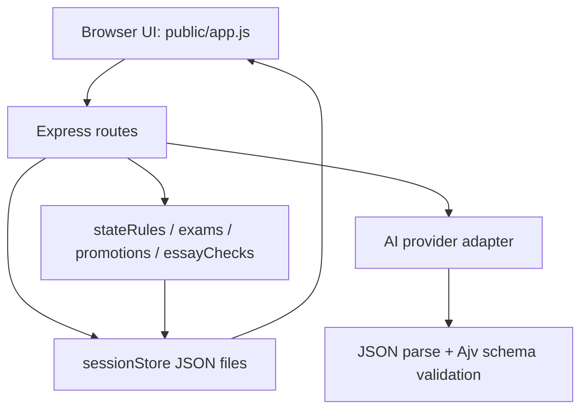

# Qianqiu Developer Architecture

This document is the short implementation map for developers continuing the phase-one codebase. The longer product and process source of truth remains [docs/QIANQIU_DEVELOPMENT_BRIEF.md](QIANQIU_DEVELOPMENT_BRIEF.md).

## Runtime Shape

Qianqiu is intentionally buildless in phase one:

- Backend: Node.js + Express in `server.js`.
- Frontend: plain HTML/CSS/JS in `public/`.
- Storage: local JSON files under `data/sessions/`.
- AI: adapter-based providers behind `src/ai/index.js`.
- Tests: Node.js built-in `node --test`.

The app should stay runnable with:

```bash
npm install
npm start
```

Then visit `http://localhost:3000`. Mock mode is the default local path.

## Request Flow



Important route ownership:

- `src/routes/game.js` creates sessions, reads sessions, and advances free-text turns.
- `src/routes/exam.js` generates saved exam questions and submits essays.
- `src/game/stateRules.js` is the only way provider state patches should be merged.
- `src/game/exams.js` owns exam levels, gates, thresholds and next-exam mapping.
- `src/game/promotions.js` owns rank changes, official promotion and severe-cheating consequences.
- `src/game/essayChecks.js` owns local anti-cheat checks and score penalties.
- `src/game/candidates.js` owns virtual same-field candidates and ranking.

## API Contract

### `GET /api/health`

Returns:

```json
{
  "ok": true,
  "aiProvider": "mock"
}
```

### `POST /api/game/start`

Request fields:

- `dynasty`
- `year`
- `role`
- `playerName`
- `background`
- `customSetting`

Returns `201` with `sessionId`, `worldState`, and opening `narrative`.

### `GET /api/game/state/:sessionId`

Reads the JSON session file and returns `sessionId` plus `worldState`.

### `POST /api/game/turn`

Request:

```json
{
  "sessionId": "uuid",
  "input": "研读《论语》三日"
}
```

Returns plain JSON:

```json
{
  "sessionId": "uuid",
  "narrative": "...",
  "attributeChanges": [],
  "examTrigger": {
    "shouldStart": false,
    "level": null,
    "reason": ""
  },
  "worldState": {}
}
```

Current implementation is non-streaming. The brief still lists SSE as a later step.

### `POST /api/exam/question`

Request:

```json
{
  "sessionId": "uuid",
  "level": "child_exam"
}
```

`level` may be omitted; the server derives the next eligible exam from `player.examRank`. The route saves a complete `worldState.activeExam`, reuses an existing unanswered exam for the same level, and rejects attempts to open a different exam while another question is active.

Returns `examId`, exam metadata, requirements, readiness, and `worldState`.

### `POST /api/exam/submit`

Request:

```json
{
  "sessionId": "uuid",
  "examId": "child_exam-uuid",
  "essay": "..."
}
```

The server checks authenticity, asks the provider for grading, applies local penalties, builds virtual candidates, applies promotion or cheating consequences, appends the essay result to `player.examHistory`, clears `activeExam`, saves the session and returns the result plus `worldState`.

## AI Provider Contract

Providers expose four methods:

- `startGame(worldState)`
- `runTurn(worldState, input)`
- `generateExamQuestion(worldState, exam)`
- `gradeExamEssay(worldState, exam, essay, authenticityCheck)`

Provider outputs must match the schemas in `src/ai/schemas.js`:

- `opening`: `{ narrative, events }`
- `turn`: `{ narrative, statePatch, attributeChanges, events, examTrigger }`
- `examQuestion`: exam level, name, question, type, difficulty, requirements, word count, pass score and promotion rank
- `grade`: five score dimensions, `overall_score`, rank, detailed feedback, authenticity echo, candidates and ranking placeholders

Real provider adapters parse model text through `src/utils/json.js`, validate with Ajv, retry once on failure, then fall back to Mock for that method. The model never owns final game state. It can suggest `statePatch`; the server whitelists and clamps it.

## State Model

`createInitialState()` in `src/game/initialState.js` returns a `worldState` with:

- Global fields: `sessionId`, `year`, `dynasty`, `turnCount`, `treasury`, `grainReserve`, `population`, `publicOrder`, `taxRate`, `corruption`, `armySize`, `armyMorale`, `borderThreat`.
- Factions: `factions.eunuchs`, `factions.scholarOfficials`, `factions.militaryLords`.
- Narrative and exam fields: `characters`, `eventHistory`, `activeExam`, `setup`.
- Player identity: `player.role`, `roleLabel`, `name`, `health`, `gold`.
- Scholar fields: `examRank`, `palaceRank`, `officeTitle`, `academia`, `literaryTalent`, `adaptability`, `mentality`, `reputation`, `examHistory`, `teacher`, `studiedBooks`, `connections`.
- Role fields: `personalPower`, `courtControl`, `mandate`, `position`, `faction`, `influence`, `integrity`.

Allowed roles currently include `scholar`, `emperor`, `minister`, `general`, `magistrate`, and `official`. Mock gameplay is most complete for `scholar`, `emperor`, `minister`, and `official`; `general` and `magistrate` still use generic fallback behavior in phase one.

## State Patch Rules

`applyStatePatch(worldState, statePatch)` enforces:

- Only whitelisted top-level and `player` keys can be changed.
- Numeric fields are clamped to ranges in `NUMERIC_RANGES`.
- `eventHistory` is trimmed to the latest 20 entries.
- `statePatch.factions` may only update existing numeric faction keys; providers cannot invent arbitrary faction names.
- `turnCount` increments when a turn patch is applied.

Do not bypass this module when applying provider output.

## Exam Rules

The exam path is:

```text
寒窗 -> 童试 -> 秀才 -> 乡试 -> 举人 -> 会试 -> 贡士 -> 殿试 -> 进士 -> 入仕官员
```

Exam levels:

| Level | Name | Required Rank | Promotion | Pass |
| --- | --- | --- | --- | --- |
| `child_exam` | 童试 | none | 秀才 | 60 |
| `provincial_exam` | 乡试 | 秀才 | 举人 | 68 |
| `metropolitan_exam` | 会试 | 举人 | 贡士 | 74 |
| `palace_exam` | 殿试 | 贡士 | 进士 / official | normally not failed unless severe cheating |

Promotion is applied in `src/game/promotions.js`, not by the provider. Palace exam assigns `player.role = "official"`, a palace rank, an office title, `position`, `faction`, `influence`, and `integrity`.

## Persistence

Session files are written to `data/sessions/{sessionId}.json`. Session ids must match a UUID-like safe pattern before the path is built. `data/sessions/*.json` is ignored by Git; only `data/sessions/.gitkeep` should be committed.

## Verification

Use:

```bash
npm test
```

For local acceptance, run the checklist in [docs/MANUAL_ACCEPTANCE.md](MANUAL_ACCEPTANCE.md). When a release slice is accepted, record the exact commands, result and known limitations in [docs/PHASE_ONE_ACCEPTANCE.md](PHASE_ONE_ACCEPTANCE.md), `docs/SHARED_CONTEXT.md`, and `docs/DEVELOPMENT_STEPS.md`.
